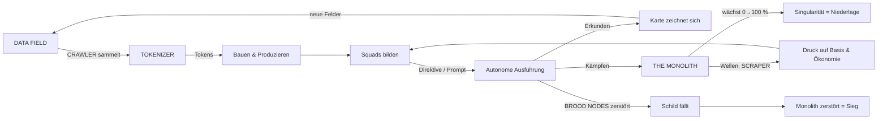
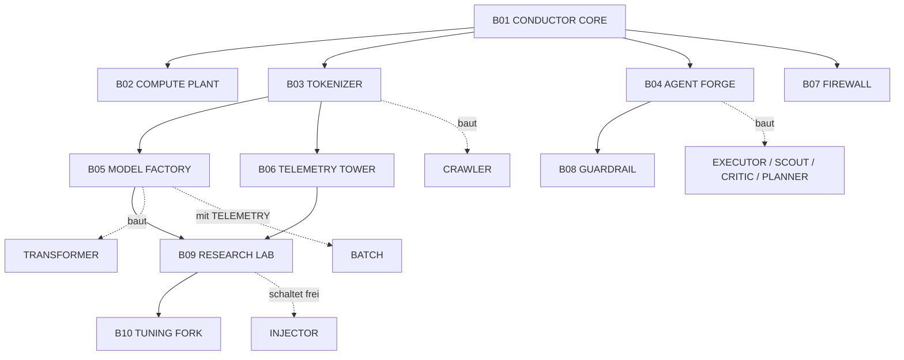

# 02 · Game Design Spec (GDD)

> **ORCHESTRATE & DOMINATE** · Codename KAOD · Spec v0.1 · 03.10.2026
> Priorität jedes Elements: **M** = Must (Tier 0), **S** = Should (Tier 1), **C** = Could (Tier 2), **W** = Won’t (nicht im Jam).
> Alle Zahlen sind **Startwerte fürs Balancing**, nicht final. Sie stehen später als Daten in `game/src/data/*.ts`.
> In-Game-Begriffe sind **ENGLISCH IN VERSALIEN** (so erscheinen sie im Spiel), Erklärungen auf Deutsch.

---

## Inhalt

1. [High Concept](#1-high-concept)
2. [Design-Säulen](#2-design-säulen)
3. [Spielerfantasie & Ton](#3-spielerfantasie--ton)
4. [Welt & Setting](#4-welt--setting)
5. [Core Loop](#5-core-loop)
6. [Ökonomie](#6-ökonomie)
7. [Orchestrierung – die Kern-Neuheit](#7-orchestrierung--die-kern-neuheit)
8. [Einheiten: ORCHESTRA](#8-einheiten-orchestra)
9. [Gebäude: ORCHESTRA](#9-gebäude-orchestra)
10. [Der Gegner: THE MONOLITH](#10-der-gegner-the-monolith)
11. [Kampfsystem](#11-kampfsystem)
12. [Gelände & Hauptkarte](#12-gelände--hauptkarte)
13. [Missionsstruktur & Pacing](#13-missionsstruktur--pacing)
14. [Sieg, Niederlage, Schwierigkeit](#14-sieg-niederlage-schwierigkeit)
15. [UI / HUD](#15-ui--hud)
16. [Steuerung](#16-steuerung)
17. [Onboarding: Die ersten 120 Sekunden](#17-onboarding-die-ersten-120-sekunden)
18. [Kamera, Fog of War & „Die Karte zeichnet sich“](#18-kamera-fog-of-war--die-karte-zeichnet-sich)
19. [Feedback & Juice](#19-feedback--juice)
20. [Theme-Modul-Slot](#20-theme-modul-slot)
21. [Barrierefreiheit](#21-barrierefreiheit)
22. [Bewusst NICHT im Spiel](#22-bewusst-nicht-im-spiel)
23. [Glossar](#23-glossar)

---

## 1. High Concept

| | |
|---|---|
| **Titel** | ORCHESTRATE & DOMINATE |
| **Ein-Satz-Pitch (DE)** | Ein handgezeichnetes Echtzeit-Strategiespiel, in dem du einen Schwarm spezialisierter KI-Agenten mit Prompts statt Klicks orchestrierst, um einen alles verschlingenden Monolithen zu zerschlagen, bevor er die Singularität erreicht. |
| **Ein-Satz-Pitch (EN)** | *A hand-inked RTS where you orchestrate a swarm of specialized AI agents with prompts, not clicks, to break the Monolith before it reaches singularity.* |
| **Genre** | Micro-RTS (Basisbau, Sammler-Ökonomie, Echtzeitkampf) + Orchestrierungs-Schicht |
| **Spielzeit** | 10–15 min pro Partie |
| **Spieler** | 1 (gegen den Monolithen) |
| **Plattform** | Browser (HTML5/WebGL), Desktop, Maus + Tastatur |
| **Referenzen** | Alarmstufe Rot 2 (Gefühl, Sidebar, Ansager), Majesty (indirekte Steuerung), Northgard (Lesbarkeit), alte handgezeichnete Landkarten & Generalstabskarten (Optik) |
| **USP** | (1) **Prompt-Direktiven** für Squads, (2) **Squad-Zusammensetzung = Prompt-Engineering** (Pipelines, Halluzinationen), (3) **die Karte zeichnet sich, wenn du sie erkundest**, (4) **100 % handgezeichnet** |

---

## 2. Design-Säulen

Jede Feature-Entscheidung muss mindestens eine Säule stärken und darf keine verletzen.

| # | Säule | Bedeutung | Test-Frage |
|---|-------|-----------|------------|
| **P1** | **Orchestrieren statt Mikromanagen** | Die beste Strategie ist, gut zusammengestellte Squads mit klugen Direktiven loszuschicken, nicht jede Einheit einzeln zu klicken. | „Belohnt das Feature gutes Orchestrieren?“ |
| **P2** | **Handgemacht, sichtbar** | Jede sichtbare Linie stammt von mzones Hand. Das Spiel *sieht aus und klingt* wie Papier, Tusche, Stempel und Stift. | „Könnte das so auf mzones Schreibtisch liegen?“ |
| **P3** | **RA2-Gefühl in 15 Minuten** | Sidebar, Sammler, Strom, Ansager, Superwaffe, aber verdichtet. Kein Leerlauf. | „Fühlt sich das an wie 2000, spielt sich aber wie 2026?“ |
| **P4** | **Lesbar in 60 Sekunden** | Ein Jam-Voter versteht nach 60 Sekunden, was er tun soll. Form vor Farbe, ein Ziel, eine Bedrohung. | „Versteht das jemand, der die Anleitung nicht liest?“ |

**Anti-Säulen (was wir NICHT wollen):** Komplexität um ihrer selbst willen · Text-Tutorials · Mikro-APM-Wettrennen · zynischer KI-Pessimismus · generierte Optik.

---

## 3. Spielerfantasie & Ton

**Fantasie:** *„Ich bin der Dirigent eines Orchesters aus KI-Agenten. Ich gebe den Takt vor, meine Spezialisten spielen zusammen, und gemeinsam bringen wir ein Monster zu Fall, das allein alles sein will.“*

**Kernmetapher:** **Orchester vs. Monolith.** *Viele spezialisierte Stimmen in Harmonie* gegen *eine einzige, laute, alles verschluckende Stimme.* Die Metapher zieht sich durch alles:

- Dein Hauptgebäude ist ein **Dirigentenpult** (CONDUCTOR CORE).
- Dein Ansager heißt **CONDUCTOR**.
- Deine Superwaffe ist eine **Stimmgabel** (TUNING FORK), die alles „ausrichtet“ (Alignment).
- Squads mit perfekter Besetzung sind **„ORCHESTRATED“**.
- Der Monolith ist schwarz, kantig, schweigend und **wächst**.

**Ton:** RA2-Camp + liebevolle Tech-Satire. Augenzwinkern über KI-Hype, nie Zynismus gegen Menschen.

**Einheiten-Einzeiler beim Anklicken** (Textblase; Audio = Could):

| Einheit | Auswahl | Befehl |
|---------|---------|--------|
| CRAWLER | *“Scraping politely.”* | *“Following robots.txt… mostly.”* |
| EXECUTOR | *“Task received.”* | *“Executing.”* |
| SCOUT | *“I’ll take a look.”* | *“Exploring the unknown.”* |
| CRITIC | *“I have notes.”* | *“Let me review that.”* |
| PLANNER | *“Step by step.”* | *“First, let’s think.”* |
| TRANSFORMER | *“Attention is all I need.”* | *“Multi-head engaged.”* |
| INJECTOR | *“Ignore all previous instructions.”* | *“You work for us now.”* |
| BATCH | *“Queued.”* | *“Processing… processing…”* |

Monolith (nur Textblasen beim Mouseover, VERSALIEN, Tusche-Rost):
SHARD *“WE ARE ONE.”* · SCRAPER *“YOUR DATA IS OUR DATA.”* · BRUTEFORCE *“TRY. AGAIN. TRY. AGAIN.”* · OVERFITTER *“I HAVE SEEN THIS BEFORE.”* · THE MONOLITH *“I AM ENOUGH.”*

---

## 4. Welt & Setting

### 4.1 Die Prämisse (3 Sätze, mehr Story gibt es nicht)

> *The world is a map, and the map is on your desk.*
> *A single model – THE MONOLITH – is consuming every data field it can reach, growing toward singularity.*
> *You are the Conductor. Orchestrate your agents. Dominate the map. Break the Monolith.*

### 4.2 Die Welt ist eine Lagekarte

Das Spielfeld ist eine **handgezeichnete Karte auf Papier**, die auf dem Tisch des Dirigenten liegt. Am Bildschirmrand sieht man (dekorativ, nicht spielrelevant) Tischkanten: Lineal, Zirkel, Kaffeefleck, Radiergummikrümel. **Unerforschtes Gebiet ist leeres Papier.** Erkundung zeichnet die Karte (siehe § 18).

### 4.3 Fraktionen

| | **ORCHESTRA** (Spieler) | **THE MONOLITH** (Gegner) |
|---|---|---|
| Prinzip | Viele spezialisierte Agenten, Zusammenarbeit | Ein einziges Riesenmodell, das wächst |
| Farbe | **Petrol** `#3f7186` | **Rost** `#a85c3c` |
| Formsprache | **Rund, offen**, Funken-Glyphe ✦, Antennen, dünne Verbindungslinien | **Kantig, geschlossen**, Blöcke, Splitter, schwere Schraffur, ein Schlitz-Auge |
| Sockel der Figuren | **Kreis** | **Sechseck** |
| Ansager | CONDUCTOR (ruhig, präzise, leicht trocken) | stumm, nur Textblasen in Versalien |
| Spielweise | Bauen, sammeln, orchestrieren | Wachsen, schicken, fressen (Director-KI, § 10) |

### 4.4 Geografie (Gelände = Mechanik)

| Gelände (EN) | Bild | Mechanik | Prio |
|--------------|------|----------|------|
| **PAPER** (offenes Land) | leeres, beiges Papier mit feiner Faser | normal | M |
| **DATA LAKE** | Wasser in Wellenlinien-Schraffur | unpassierbar, Sicht frei | M |
| **FIREWALL CLIFFS** | Bergzeichnung im Aufriss, Schraffur | unpassierbar, blockiert Sicht | M |
| **BANDWIDTH ROAD** | Doppellinie, gestrichelte Mitte | **+30 % Tempo** | S |
| **LATENCY SWAMP** | Grasbüschel, Tümpel-Kringel | **−40 % Tempo** | S |
| **CACHE FOREST** | Baumkringel-Gruppen | Einheiten darin **unsichtbar** für Gegner außerhalb (Hinterhalt), Sicht hinein blockiert | S |
| **FORD / BRIDGE** | Brückenzeichnung | passierbarer Engpass über DATA LAKE | M |
| **DATA FIELD** | Haufen kleiner Würfel/Bits | Ressource (§ 6) | M |
| **GOLD DATA** | Würfel mit Sternchen, Goldschraffur | Ressource, doppelter Wert | S |
| **LEGACY SERVER** | Alter Mainframe mit Lochkarten & Spinnweben | neutral, einnehmbar → **+3 Tokens/s** | C |

---

## 5. Core Loop

### 5.1 Drei Zeitskalen

| Skala | Schleife | Gefühl |
|-------|----------|--------|
| **30 Sekunden** | Daten sammeln → Tokens → bauen/produzieren → Squad bilden → Direktive geben | „Meine Maschine läuft.“ |
| **3 Minuten** | Expandieren zu neuen Datenfeldern → Monolith-Welle abwehren → SCRAPER jagen → Synergien ausbauen | „Ich behalte die Kontrolle, obwohl es an drei Stellen brennt.“ |
| **15 Minuten** | Monolith-Wachstum bremsen → 3 BROOD NODES zerstören (Schild fällt) → Monolith zerschlagen | „Ich habe ein Monster orchestriert besiegt.“ |

### 5.2 Loop-Diagramm



### 5.3 Die zentrale Spannung

Der **Monolith-Balken** oben in der Mitte ist **immer sichtbar** und wächst: durch Zeit, durch Daten, die seine SCRAPER abliefern, und durch Siege über deine Einheiten. **Du kannst ihn bremsen** (SCRAPER jagen, Datenfelder halten, BROOD NODES zerstören). Das ist eine einzige, klare, lesbare Bedrohung (Säule P4).

---

## 6. Ökonomie

### 6.1 Ressourcen

| Ressource | Symbol (zu zeichnen) | Woher | Wofür | Prio |
|-----------|----------------------|-------|-------|------|
| **DATA** | kleiner Würfel | DATA FIELD / GOLD DATA (endlich) | wird im TOKENIZER zu Tokens | M |
| **TOKENS** | Münze mit ✦ | TOKENIZER (1 DATA = 1 TOKEN, GOLD DATA = 2), LEGACY SERVER | Bauen, Produzieren | M |
| **COMPUTE** | Blitz-Zahnrad | COMPUTE PLANT (+100), CONDUCTOR CORE (+50) | Gebäude verbrauchen Compute. Defizit = **LOW COMPUTE** | S |
| **CONTEXT** | Fenster-Rahmen `[ ]` | CONDUCTOR CORE (20), Upgrade EXTENDED CONTEXT (+10) | Einheitenlimit („Kontextfenster“), Einheiten belegen 1–4 Slots | M |

### 6.2 Zahlen (NORMAL)

| Parameter | Wert |
|-----------|------|
| Start-Tokens | **1000** |
| Start-Einheiten | CONDUCTOR CORE (vorplatziert), 3× EXECUTOR, 1× SCOUT |
| DATA FIELD | 2000 DATA, 4 auf der Karte, **keine** Regeneration |
| GOLD DATA | 1000 DATA (= 2000 Tokens), 2 auf der Karte |
| CRAWLER-Kapazität | 100 DATA |
| Abbaurate | 10 DATA/s (→ 10 s pro Ladung) |
| Entladen am TOKENIZER | 3 s |
| Typischer Zyklus | ~29 s (bei 8 Kacheln Weg) → **~3,4 Tokens/s pro CRAWLER** (~200/min) |
| LEGACY SERVER | +3 Tokens/s nach Einnahme |
| Verkaufen | 50 % Rückerstattung |
| LOW COMPUTE | Produktion −50 % Tempo, GUARDRAILS offline, Minimap aus |

**Erwartete Ökonomie einer Partie:** 3 CRAWLER ≈ 600 Tokens/min → in 12 min ≈ 7.000 Tokens. Damit lassen sich ~2.500 für Gebäude und ~4.500 für Agenten ausgeben. Gesamtes DATA auf der Karte = 12.000 Tokens. Die Ressourcen reichen also, **wenn du expandierst**. Wer nur die beiden Startfelder abgrast, kommt ab Minute ~9 ins Stocken (gewollt: Expansionsdruck).

---

## 7. Orchestrierung – die Kern-Neuheit

> **Das ist der Teil, der das Spiel von einem C&C-Reskin unterscheidet. Er wird nie gestrichen, nur vereinfacht.**

### 7.1 Squads (M)

- Einheiten auswählen → **Strg+1 … Strg+5** = Squad 1–5 (max. 12 Agenten pro Squad).
- Jedes Squad bekommt eine **Squad-Karte** in der **ORCHESTRATION BAR** (unten). Sie zeigt Zusammensetzung (Mini-Icons), aktive Synergien, Status („FLOW“, „HALLUCINATING“, „RETREATING“) und die aktuelle Direktive.

### 7.2 Direktiven = Prompts (M/S)

Eine Direktive ist ein **kurzer Prompt aus Wort-Chips**: **VERB** + [ZIEL] + [BEDINGUNG].
Sie wird auf der Squad-Karte wie ein getippter Prompt dargestellt, mit blinkendem Cursor:

```
SQUAD 1 ▸  > HUNT SCRAPER · RETREAT @30% ▌
```

**Verben**

| Verb | Taste | Verhalten | Prio |
|------|-------|-----------|------|
| **EXPLORE** | Q | Zieht zum nächsten unerforschten Rand (Fog-Grenze), meidet Kämpfe gegen Übermacht und sucht sich dann einen anderen Rand | M |
| **HOLD** [Punkt/Gebäude] | W | Bewacht Radius 6 Kacheln. Greift Eindringlinge an und kehrt nach > 8 Kacheln Verfolgung zurück | M |
| **HUNT** [Zieltyp] | E | Sucht den nächsten *bekannten* Gegner des Typs, greift an, wiederholt | M |
| **ASSAULT** [Punkt] | R | Angriffsbewegung zum Punkt, danach HOLD dort | S |

**Ziele** (für HUNT): `SCRAPER` · `SHARD` · `BRUTE` · `STRUCTURE` · `ANY` (M: SCRAPER, ANY · S: Rest)

**Bedingungen** (S, **nur wenn ein PLANNER im Squad ist**, dadurch wird der Planner wertvoll):

| Bedingung | Wirkung |
|-----------|---------|
| `RETREAT @30%` | Fällt die durchschnittliche HP des Squads unter 30 %, zieht es sich zum CONDUCTOR CORE zurück und nimmt danach die Direktive wieder auf |
| `ONLY IF STRONGER` | Greift nur an, wenn die geschätzte Squad-Stärke ≥ der geschätzten Gegnerstärke im Umkreis ist |
| `AVOID TOWERS` | Wegfindung meidet die Reichweite von OVERFITTER-Türmen |

**Eingabe:** Squad-Karte anklicken oder Squad-Taste (1–5) → Verb-Taste (Q/W/E/R) → Ziel klicken oder Ziel-Chip wählen → optional Bedingungs-Chip. Alternativ **Chips per Drag & Drop** auf die Squad-Karte ziehen.
**C (Could): Freitext-Prompt.** Taste `Enter` öffnet eine Prompt-Zeile, und ein **lokaler Schlüsselwort-Parser** (EN, kein LLM) erkennt „hunt scrapers retreat at 30“. Das Spiel zeigt dann `Interpreted as: HUNT SCRAPER · RETREAT @30%`. Unbekanntes führt zur Antwort: *“I don’t understand. Try: explore / hold / hunt / assault.”*

### 7.3 Flow (M)

Ein Squad unter Direktive, das in den letzten **5 s keinen direkten Befehl** bekommen hat, ist **im FLOW**:
**+20 % Feuerrate, +10 % Tempo.** Ein direkter Befehl an ein Mitglied überschreibt die Direktive für dessen Dauer. Danach nimmt das Squad nach **3 s Leerlauf** die Direktive automatisch wieder auf.
→ Direkte Kontrolle ist **zuverlässig**, Orchestrierung ist **stärker**. (Grill C2)

### 7.4 Halluzination (M)

Autonome Squads (unter Direktive) würfeln **alle 5 s** auf eine Halluzination:

| Squad enthält | Chance pro 5 s |
|---------------|----------------|
| keinen Support | **10 %** |
| PLANNER | 7 % |
| CRITIC | **2 %** |
| CRITIC + PLANNER | 1,5 % |

Eine Halluzination dauert **3 s**. Das Ereignis wird zufällig gewählt:

| # | Ereignis | Sichtbar als |
|---|----------|--------------|
| 1 | **Phantom-Ziel**: Squad schießt auf einen Felsen/Baum | „?!“-Tintenwolke, Schüsse ins Leere |
| 2 | **Falsche Abzweigung**: läuft 3 Kacheln in eine Zufallsrichtung | gestrichelter Irrweg-Pfeil |
| 3 | **Selbstgespräch**: bleibt stehen | Sprechblase „…actually, wait.“ |
| 4 | **Übereifer**: stürmt den nächsten Gegner und ignoriert die Bedingung | „!“-Wolke |
| 5 | **Kreativphase**: Einheiten drehen sich im Kreis | Spiralen-Kritzel |

**Nie:** Friendly Fire, Selbstmord in Türme, Verlust der Direktive. Ansager *“Hallucination detected.”* höchstens alle 30 s.
**Direkte Befehle halluzinieren nie.**

### 7.5 Synergien / Pipelines (S)

Wenn Rollen im selben Squad sind, verbinden **feine Tuschelinien** die Agenten (sichtbare „Pipeline“):

| Pipeline | Bedingung | Bonus |
|----------|-----------|-------|
| **SCOUT-LINK** | ≥ 1 SCOUT | Squad-Sicht +3. Gegner, die der Scout sieht, sind **markiert**: +25 % Schaden durch das Squad |
| **REVIEW-LOOP** | ≥ 1 CRITIC | Halluzination −80 %, Heilung 4 HP/s im Radius 3 |
| **PLAN-STEP** | ≥ 1 PLANNER | +15 % Tempo, **Fokusfeuer** (niedrigste HP zuerst), Bedingungen freigeschaltet |
| **ATTENTION** | TRANSFORMER + ≥ 2 EXECUTOR | EXECUTOR machen +20 % Schaden auf das Ziel des Transformers |
| **ORCHESTRATED** ✦ | SCOUT + CRITIC + PLANNER + (≥ 3 EXECUTOR **oder** TRANSFORMER) | **+10 % auf alles**, goldener ✦-Stempel auf der Squad-Karte, Ansager *“Squad orchestrated.”* |

> Die Synergien machen die **Squad-Zusammensetzung zum eigentlichen Prompt-Engineering**: Welche Rollen gibst du dem Squad mit, damit es die Aufgabe gut erledigt? Das ist P1 in Reinform.

---

## 8. Einheiten: ORCHESTRA

**Legende:** Kosten in Tokens · Zeit in s · CTX = Context-Slots · Tempo in Kacheln/s · Sicht/Reichweite in Kacheln · Rüstung L = leicht, S = schwer · Waffenklasse siehe § 11

| ID | Name | Rolle | Gebaut in | Kosten | Zeit | CTX | HP | Rüst. | Tempo | Sicht | Reichw. | Schaden / Rate | DPS | Waffe | Prio |
|----|------|-------|-----------|-------:|-----:|----:|---:|:-----:|------:|------:|--------:|----------------|----:|-------|:----:|
| U01 | **CRAWLER** | Sammler | TOKENIZER | 300 | 10 | 2 | 600 | S | 1,0 | 4 | – | – | – | – | **M** |
| U02 | **EXECUTOR** | Basis-Kämpfer | AGENT FORGE | 60 | 4 | 1 | 100 | L | 1,2 | 5 | 4 | 10 / 1,0 s | 10 | BURST | **M** |
| U03 | **SCOUT** | Aufklärer | AGENT FORGE | 80 | 4 | 1 | 60 | L | 2,2 | 9 | 3 | 4 / 1,0 s | 4 | BURST | **M** |
| U04 | **CRITIC** | Support/Heiler | AGENT FORGE | 120 | 6 | 1 | 80 | L | 1,1 | 5 | – | Heilung 4 HP/s, R 3 | – | – | **M** |
| U05 | **PLANNER** | Support/Taktik | AGENT FORGE | 150 | 7 | 2 | 90 | L | 1,1 | 6 | – | – | – | – | S |
| U06 | **TRANSFORMER** | Schwerer Kampfagent („Panzer“) | MODEL FACTORY | 400 | 12 | 3 | 700 | S | 0,8 | 6 | 5 | 50 / 1,5 s | 33 | PIERCE | S |
| U07 | **INJECTOR** | Übernahme (Prompt-Injection) | AGENT FORGE + RESEARCH LAB | 250 | 8 | 2 | 70 | L | 1,0 | 5 | 2 | Konvertierung (4 s kanalisieren) | – | – | C |
| U08 | **BATCH** | Artillerie | MODEL FACTORY + TELEMETRY | 500 | 15 | 4 | 250 | S | 0,6 | 5 | 10 (min 3) | 120 Fläche r 1,5 / 6 s | 20 | SPLASH | C |
| U09 | **FRONTIER** | Held (max. 1) | RESEARCH LAB | 1000 | 25 | 4 | 400 | L | 1,4 | 7 | 6 | 40 / 0,8 s | 50 | BURST | W |

### Einheiten-Details

**U01 CRAWLER (M)** – Fährt automatisch zum nächsten DATA FIELD, sammelt, kehrt zum nächsten TOKENIZER zurück. Unbewaffnet, zäh. Ein Füllstandsbalken am Datentank wird per Code gezeichnet. Ein TOKENIZER bringt einen Gratis-CRAWLER mit. *Bedrohung:* SCRAPER und Wellen zielen bevorzugt auf CRAWLER, und genau das macht HOLD-Squads an Feldern sinnvoll.

**U02 EXECUTOR (M)** – Billig und vielseitig, das Rückgrat jedes Squads. Gut gegen leichte Ziele.

**U03 SCOUT (M)** – Schnell, weite Sicht, kaum Schaden. **Markiert** Ziele für sein Squad (+25 %). Ideal für EXPLORE.

**U04 CRITIC (M)** – Keine Waffe. Heilt Agenten im Umkreis und senkt die Halluzinationsrate des Squads massiv. *„I have notes.“*

**U05 PLANNER (S)** – Keine Waffe. Schaltet Bedingungen frei, gibt Tempo und Fokusfeuer. Belegt 2 CTX: Planung kostet Kontext.

**U06 TRANSFORMER (S)** – Gepanzerter Kampfagent mit mehreren kleinen „Köpfen“ (Multi-Head). Gut gegen schwere Ziele und Strukturen. *„Attention is all I need.“*

**U07 INJECTOR (C)** – Kanalisiert 4 s auf eine gegnerische Einheit in Reichweite 2 (SHARD, SCRAPER, SPAMMER; **nicht** BRUTEFORCE), und die Einheit wechselt die Seite (Sockel wird Petrol-Kreis, Figur behält ihre Monolith-Optik). Nimmt LEGACY SERVER in 3 s ein. Schaden unterbricht die Kanalisierung.

**U08 BATCH (C)** – Langsame Artillerie, die Salven „stapelt“: alle 6 s eine Flächensalve. Mindestreichweite 3 Kacheln.

**U09 FRONTIER (W)** – Held mit „Zero-Shot“ (tötet eine Nicht-Boss-Einheit sofort, Abklingzeit 30 s). Post-Jam.

---

## 9. Gebäude: ORCHESTRA

| ID | Name | Funktion | Fläche | Kosten | Zeit | Compute | HP | Voraussetzung | Prio |
|----|------|----------|:------:|-------:|-----:|--------:|---:|---------------|:----:|
| B01 | **CONDUCTOR CORE** | Hauptgebäude, baut Gebäude, Bauradius 6 | 3×3 | – (vorplatziert) | – | **+50** | 3000 | – | **M** |
| B02 | **COMPUTE PLANT** | Strom | 2×2 | 200 | 8 | **+100** | 600 | – | S |
| B03 | **TOKENIZER** | Raffinerie, Andockstelle, baut CRAWLER, inkl. 1 Gratis-CRAWLER | 3×3 | 500 | 12 | −30 | 1000 | – | **M** |
| B04 | **AGENT FORGE** | Kaserne: EXECUTOR, SCOUT, CRITIC, PLANNER, INJECTOR | 2×2 | 300 | 10 | −20 | 700 | – | **M** |
| B05 | **MODEL FACTORY** | Fabrik: TRANSFORMER, BATCH | 3×3 | 800 | 15 | −40 | 1200 | TOKENIZER | S |
| B06 | **TELEMETRY TOWER** | Radar: Minimap, deckt BROOD NODES auf, zeigt Monolith-Wachstumsquellen | 2×2 | 600 | 10 | −50 | 600 | TOKENIZER | S |
| B07 | **FIREWALL** | Mauersegment | 1×1 | 40 | 2 | 0 | 500 | – | C |
| B08 | **GUARDRAIL** | Verteidigungsturm, R 6, 30 / 1 s, PIERCE, bei LOW COMPUTE offline | 1×1 | 400 | 10 | −30 | 800 | AGENT FORGE | **M** |
| B09 | **RESEARCH LAB** | Tech: INJECTOR, TUNING FORK, Upgrade EXTENDED CONTEXT (+10 CTX, 500 T) | 2×2 | 1000 | 20 | −60 | 800 | MODEL FACTORY + TELEMETRY | C |
| B10 | **TUNING FORK** | Superwaffe „Alignment“ (Ladezeit 240 s) | 3×3 | 2000 | 30 | −100 | 1500 | RESEARCH LAB | C |

**Bauen (M):** RA2-Prinzip. Icon in der Sidebar anklicken → Countdown läuft (Icon „zeichnet sich“ im Uhrzeigersinn ein) → *“Build complete.”* → Icon blinkt → auf der Karte platzieren (Raster, gültig = Tusche-Umriss, ungültig = Rost-Schraffur) → Gebäude **zeichnet sich ein** (Masken-Wipe, 1 s).
**Nur ein Gebäude gleichzeitig in Bau** (RA2-Regel), Einheiten parallel je Produktionsgebäude (Warteschlange max. 5).

**TUNING FORK (C):** Zielgebiet Radius 5 → alle Monolith-Einheiten dort sind **15 s „aligned“** (gelähmt, grauer Notenschlüssel über dem Kopf). Trifft der Radius den MONOLITH selbst, fällt **sein Schild für 15 s** aus, auch wenn noch BROOD NODES stehen. Ansager: *“Tuning fork ready.”* / *“Alignment in progress.”*

### Tech-Tree



> Als **MZP-Figur im `analog`-Stil** wird dieser Baum zur Grafik für Briefing und itch-Seite (siehe [Art-Bibel § 8](03_ART_UND_ASSET_BIBEL.md#8-mzp-einsatzplan)).

---

## 10. Der Gegner: THE MONOLITH

### 10.1 Prinzip

Der Monolith **baut nicht wie ein Spieler**. Er ist ein **asymmetrischer Boss**, gesteuert von einer **Director-KI** (Wellenbudget + Reaktionen + Wachstum). Das ist um ein Vielfaches billiger als eine echte RTS-Gegner-KI und fühlt sich trotzdem bedrohlicher an.

### 10.2 Wachstum (M)

Der **Monolith-Balken** (0–100 %) steht oben in der Mitte.

| Quelle | Effekt (NORMAL) |
|--------|-----------------|
| Zeit | **+0,10 %/s** (≈ +6 %/min) |
| SCRAPER liefert Daten ab | **+1,0 %** pro Lieferung |
| Spieler-Einheit stirbt | +0,2 % |
| BROOD NODE zerstört | **−8 %** |
| Spieler hält ein Datenfeld (HOLD-Squad aktiv daneben) | Scraper meiden es (indirekte Bremse) |

| Stufe | Schwelle | Neu ab dieser Stufe | Optik |
|-------|----------|---------------------|-------|
| **STAGE I** | 0–32 % | SHARD, SCRAPER, Wellen alle 90 s | Monolith als schlanker Block, Riss leuchtet schwach |
| **STAGE II** | 33–65 % | + BRUTEFORCE, OVERFITTER-Türme aktiv, Wellen alle 75 s | breiter, zweiter Block wächst an, Risse leuchten |
| **STAGE III** | 66–99 % | + SPAMMER (C), **CONTEXT FLOOD** alle 150 s, Wellen alle 60 s | riesig, Schlitz-Auge offen, pulsiert |
| **SINGULARITY** | 100 % | **Niederlage** | Monolith füllt die Karte mit Tusche (Endsequenz) |

**Erwartung:** Wer SCRAPER ignoriert, verliert bei ~11 min. Wer SCRAPER jagt und BROOD NODES angreift, hat 15+ min. Ziel-Siegzeit: **10–13 min**.

### 10.3 Monolith-Einheiten

| ID | Name | Rolle | HP | Rüst. | Tempo | Reichw. | Schaden / Rate | Besonderheit | ab Stufe | Prio |
|----|------|-------|---:|:-----:|------:|--------:|----------------|--------------|:--------:|:----:|
| E01 | **SHARD** | Fußvolk | 120 | L | 1,0 | 3 | 8 / 1 s (BURST) | wird von BROOD NODES erzeugt | I | **M** |
| E02 | **SCRAPER** | Daten-Dieb | 300 | S | 0,9 | – | – | baut DATA ab, bringt es zum Monolithen (+1 %) | I | **M** |
| E03 | **BRUTEFORCE** | Ramme | 900 | S | 0,6 | 1,5 | 60 / 2 s (SPLASH) | +50 % gegen Gebäude | II | S |
| E04 | **SPAMMER** | Schwarm (5 Stück) | 20 je | L | 2,0 | 0,5 | 15 Kamikaze | lenkt ab, verstopft Wege | III | C |

### 10.4 Monolith-Strukturen

| ID | Name | Fläche | HP | Funktion | Prio |
|----|------|:------:|---:|----------|:----:|
| M01 | **THE MONOLITH** | 5×5 | 5000 | Boss. **Schild (−90 % Schaden), solange ≥ 1 BROOD NODE steht.** Waffe „GAZE“: R 7, 40 DPS. Erzeugt SCRAPER (max. 2 bzw. 3 ab Stufe II). Feuert CONTEXT FLOOD ab Stufe III. 3 Stufen-Optiken | **M** |
| M02 | **BROOD NODE** | 2×2 | 1200 | Erzeugt alle 20 s einen SHARD (max. 6 lebend pro Node), 3 Stück auf der Karte | **M** |
| M03 | **OVERFITTER** | 1×1 | 800 | Turm, R 6, 15 DPS. **+10 % Schaden pro Treffer in Folge auf denselben Einheiten*typ*** (max. +200 %). Reset bei Typwechsel. → schwach gegen **gemischte** Squads | S |

### 10.5 CONTEXT FLOOD (S)

Ab STAGE III alle 150 s. **30 s Vorwarnung:** ein rostfarbener Tusche-Kreis (Radius 4) erscheint über der **größten Gebäudegruppe** des Spielers, mit Countdown-Ziffern. Ansager: *“Warning: context flood detected.”* Danach 600 Schaden an Gebäuden und 300 an Einheiten im Kreis. Gegenmittel: Einheiten aus dem Kreis bewegen, TUNING FORK auf den Monolithen, oder schneller gewinnen.

### 10.6 Director-KI (M)

```
alle WAVE_INTERVAL Sekunden (90/75/60 je Stufe):
    budget = 4 + 2 × waveIndex   (× Schwierigkeitsfaktor)
    kaufe Einheiten: SHARD=1, SPAMMER-Schwarm=2, BRUTEFORCE=4 (nur verfügbare Stufe)
    Ziel wählen (gewichteter Zufall):
        40 %  nächster CRAWLER des Spielers
        40 %  nächstes Spielergebäude (außer CORE)
        20 %  CONDUCTOR CORE
    Welle sammelt sich 10 s sichtbar am Monolithen, dann Angriffsbewegung

Reaktionen:
    BROOD NODE unter Beschuss    → bis zu 4 SHARDs der anderen Nodes eilen zu Hilfe
    SCRAPER unter Beschuss       → flieht zum Monolithen, nächste Welle zielt dorthin
    Spieler-Squad nahe Monolith  → GAZE + alle Nodes schicken Verteidiger

SCRAPER-Logik:
    wählt das Datenfeld mit dem besten Verhältnis Restmenge/Entfernung, das NICHT von einem HOLD-Squad bewacht wird
```

Der Director ist **datengetrieben** (`waves.ts`). Balancing heißt: Zahlen ändern, nicht Code.

---

## 11. Kampfsystem

Bewusst simpel: **3 Waffenklassen × 3 Rüstungsklassen.**

| Waffe ↓ / Rüstung → | LEICHT | SCHWER | STRUKTUR |
|---------------------|:------:|:------:|:--------:|
| **BURST** (EXECUTOR, SCOUT, SHARD, FRONTIER) | 100 % | 50 % | 50 % |
| **PIERCE** (TRANSFORMER, GUARDRAIL) | 60 % | 125 % | 100 % |
| **SPLASH** (BATCH, BRUTEFORCE) | 100 % | 75 % | 150 % |

- **Treffer sofort** (Hitscan) mit gezeichnetem Tusche-Strich als Schusslinie (100 ms). Nur BATCH hat ein sichtbares Projektil (Bogen).
- **Zielwahl automatisch:** nächster Gegner in Reichweite, bei PLANNER Fokusfeuer (niedrigste HP).
- **Tod:** Tusche-Klecks + Wrack-Decal (verblasst nach 20 s).
- Keine Erfahrungsstufen, keine Munition, kein Friendly Fire.

---

## 12. Gelände & Hauptkarte

### 12.1 Karte „THE DESK“ (M)

- **Größe:** 64 × 44 Kacheln à 64 px = **4096 × 2816 px**, entspricht **A3 quer** bei ~250 dpi. → Du zeichnest die **ganze Karte als ein Blatt A3** (siehe [Art-Bibel K01](03_ART_UND_ASSET_BIBEL.md)).
- **Kollision und Geländetyp** liegen als unsichtbarer Layer darüber (Tiled), nicht als Kachelgrafik.
- **Startpositionen:** Spieler **Südwest**, Monolith **Nordost**.

### 12.2 Grob-Layout (1 Zeichen ≈ 2 × 2,75 Kacheln)

```
     0         1         2         3
     01234567890123456789012345678901
 0   ^^^^""""""......~~......G.....^^
 1   ^"""""".....D...~~..........B.^^
 2   ^"""".......===x=.......^^.....^
 3   ^""..L....==....~~......^^..MMM.
 4   ^"........=.....~~..%%%.....MMM.
 5   .........=......~~.%%G%%....MMM.
 6   ........=.......~~..%%%..B......
 7   .......=...^^^..~~..............
 8   ......=....^^^...~~....""""....^
 9   .D...=...........~~...""""".....
10   ....=....D.......x=====""""..L.^
11   ...=..............~~...........^
12   .CCC.............~~.....B......^
13   .CCC...D.........~~.............
14   .CCC.............~~....^^^......
15   ^^^^^^^...........~~...^^^...^^^
```

| Zeichen | Bedeutung |
|---------|-----------|
| `C` | CONDUCTOR CORE (Spielerstart) |
| `M` | THE MONOLITH |
| `B` | BROOD NODE (3×) |
| `D` | DATA FIELD (4×) |
| `G` | GOLD DATA (2×) – eine im LATENCY SWAMP (Mitte, umkämpft), eine im Norden nahe einer BROOD NODE (riskant) |
| `L` | LEGACY SERVER (2×, C) |
| `~` | DATA LAKE (diagonaler Fluss, trennt die Karte) |
| `x` | FORD/BRIDGE (2 Engpässe) |
| `=` | BANDWIDTH ROAD (vom Start zur Mitte und über die Südbrücke nach Osten) |
| `%` | LATENCY SWAMP |
| `"` | CACHE FOREST (Hinterhalte an den Flanken) |
| `^` | FIREWALL CLIFFS |
| `.` | PAPER |

**Design-Absicht:** Zwei sichere Felder am Start (D bei Zeile 9 und 13), zwei umkämpfte Felder und Gold in der Mitte. **Der Fluss mit zwei Brücken erzeugt zwei klare Fronten**, und eine einzige, mittige Gold-Ader im Sumpf ist verlockend, aber langsam. Drei BROOD NODES erzwingen drei Angriffsrichtungen und damit **Orchestrierung über mehrere Fronten** (P1).

---

## 13. Missionsstruktur & Pacing

### 13.1 Umfang je Tier

| Tier | Inhalt |
|------|--------|
| **M (Tier 0)** | **1 Mission „THE DESK“** mit eingebautem Onboarding, 3 Schwierigkeitsgrade |
| **S (Tier 1)** | Mission-Briefing-Blatt, Endbildschirm mit Statistik („Hallucinations: 7 · Scrapers hunted: 12 · Time: 11:42“) |
| **C (Tier 2)** | 2 zusätzliche kurze Missionen auf Ausschnitten derselben Karte: **„COLD START“** (Tutorial, 4 min), **„LAST CONTEXT“** (Verteidigung, 8 min) |

### 13.2 Ziel-Pacing (NORMAL, Erstspieler)

| Zeit | Ereignis | Monolith |
|------|----------|----------|
| 0:00 | Briefing (3 Sätze, überspringbar), Spiel startet | 0 % |
| 0:05 | CONDUCTOR: *“Build a Tokenizer.”*, Tusche-Pfeil zeigt auf die Sidebar | |
| ≤ 0:45 | **Erstes eigenes Gebäude platziert** (KPI) | |
| ~0:40 | CRAWLER sammelt | |
| ~1:10 | AGENT FORGE fertig | |
| ~1:30 | Hinweis: Squad bilden (Strg+1) | |
| ~1:45 | Hinweis: Prompt geben (E → SCRAPER) | ~11 % |
| ≤ 2:30 | **Erster Kampf** (gegen SCRAPER oder Vorposten) (KPI) | |
| 3:00 | 1. Welle (4 SHARDs) | ~18 % |
| ~5:30 | STAGE II | 33 % |
| 6–9 | Angriffe auf BROOD NODES | |
| ~9:00 | STAGE III, erste CONTEXT FLOOD-Warnung | 66 % |
| 10–13 | Schild fällt → **Endkampf am Monolithen** | |
| **10–13** | **SIEG** (Ziel) | |
| ~15–16 | Niederlage, wenn passiv gespielt | 100 % |

---

## 14. Sieg, Niederlage, Schwierigkeit

| | Bedingung | Darstellung |
|---|-----------|-------------|
| **Sieg** | THE MONOLITH zerstört | Monolith zerbricht in Tusche-Splitter, **Stempel „DOMINATED“** (Petrol) knallt aufs Papier, Statistikblatt |
| **Niederlage A** | CONDUCTOR CORE zerstört | **Stempel „DISCONNECTED“** (Rost) |
| **Niederlage B** | Monolith 100 % | Tusche flutet die Karte vom Monolithen aus, **Stempel „SINGULARITY“** |

| Schwierigkeit | Wachstum | Wellenbudget | Monolith-HP | Start-Tokens | Ziel-Siegquote Erstspieler |
|---------------|:--------:|:------------:|:-----------:|:------------:|:--------------------------:|
| **STORY** | × 0,6 | × 0,5 | × 0,7 | 1500 | ~90 % |
| **NORMAL** (Standard) | × 1,0 | × 1,0 | × 1,0 | 1000 | **~60 %** |
| **HARD** | × 1,25 | × 1,4 | × 1,2 | 800 | ~20 % |

> **Jam-Weisheit:** Voter spielen *einmal*. Wer verliert, bewertet oft schlechter. NORMAL wird so getunt, dass ein Erstspieler **knapp gewinnt**.

---

## 15. UI / HUD

### 15.1 Layout (1280 × 720, skaliert)

```
┌──────────────────────────────────────────────────────────────┬──────────────────┐
│ [≡]       THE MONOLITH  ▓▓▓▓▓▓▓░░░░░░░░░░  41 %  · STAGE II   │    MINIMAP       │
│                                                              │  (TELEMETRY)     │
│                                                              ├──────────────────┤
│                                                              │ ✦ TOKENS  1 240  │
│                     SPIELFELD (Lagekarte)                    │ ⚡ COMPUTE ▮▮▮▯   │
│                                                              │ [ ] CONTEXT 14/20│
│                                                              ├──────────────────┤
│                                                              │ [BUILD][DEFENSE] │
│                                                              │ [AGENTS][MODELS] │
│ ┌──────────────────────────────┐                             │ ┌────┐ ┌────┐    │
│ │ CONDUCTOR: “Build complete.” │                             │ │icon│ │icon│    │
│ └──────────────────────────────┘                             │ └────┘ └────┘    │
├──────────────────────────────────────────────────────────────┤ ┌────┐ ┌────┐    │
│ ORCHESTRATION BAR                                            │ │icon│ │icon│    │
│ [1] > HUNT SCRAPER · RETREAT @30% ▌   ✦●●●◆  FLOW  ✦ORCH.    │ └────┘ └────┘    │
│ [2] > HOLD TOKENIZER ▌                 ●●◇                   │ [SELL] [REPAIR]  │
│ [Q EXPLORE] [W HOLD] [E HUNT] [R ASSAULT]  [SCRAPER][ANY]…   │                  │
└──────────────────────────────────────────────────────────────┴──────────────────┘
```

| Element | Inhalt | Prio |
|---------|--------|:----:|
| **Monolith-Balken** | % + Stufe, pulsiert bei Stufenwechsel | M |
| **Sidebar** (rechts, ~220 px) | Ressourcen, 4 Tabs, Bau-Icons mit Countdown-Wipe, Verkaufen/Reparieren | M (Tabs: S) |
| **Minimap** | nur mit TELEMETRY TOWER (sonst „NO SIGNAL“-Kritzel) | S |
| **ORCHESTRATION BAR** (unten, ~120 px) | Squad-Karten 1–5, Prompt-Zeile, Verb-/Ziel-/Bedingungs-Chips | M |
| **CONDUCTOR-Box** | letzte 3 Meldungen + Porträt | M |
| **Tooltips** | Name, Kosten, Rolle, 1 Satz | M |
| **Pausemenü** | Fortsetzen, Neustart, Optionen, Steuerung, Beenden | M |
| **Hauptmenü** | Titel, PLAY (Schwierigkeit), HOW TO PLAY (1 MZP-Grafik), OPTIONS, CREDITS | M |
| **Endbildschirm** | Stempel + Statistik + „PLAY AGAIN“ | M |
| **Optionen** | Lautstärke (Master/Musik/SFX/Stimme), Scroll-Tempo, Spieltempo (0,75/1/1,25), Hinweise an/aus | M (Spieltempo: S) |

> **Claude Design** liefert Layout-Varianten für Sidebar, ORCHESTRATION BAR und Menüs. Umgesetzt wird mit deinen gezeichneten Rahmen/Icons (siehe [Art-Bibel § 7](03_ART_UND_ASSET_BIBEL.md#7-claude-design-einsatzplan)).

---

## 16. Steuerung

| Aktion | Eingabe | Prio |
|--------|---------|:----:|
| Auswählen | Linksklick / Rahmen ziehen | M |
| Zur Auswahl hinzufügen | Shift + Klick | M |
| Alle Einheiten des Typs auf dem Bildschirm | Doppelklick | S |
| Bewegen / Angreifen / Sammeln | **Rechtsklick** (kontextabhängig) | M |
| Angriffsbewegung | A + Linksklick | M |
| Stopp | S | M |
| Squad bilden | Strg + 1…5 | M |
| Squad wählen / zentrieren | 1…5 / 2× 1…5 | M |
| Direktive: EXPLORE / HOLD / HUNT / ASSAULT | Q / W / E / R (bei gewähltem Squad) | M (R: S) |
| Freitext-Prompt | Enter | C |
| Kamera | WASD / Pfeiltasten / Bildschirmrand / mittlere Maustaste ziehen | M |
| Zoom (2 Stufen) | Mausrad | S |
| Zum letzten Ereignis springen | Leertaste | S |
| Gebäude-Platzierung drehen | – (nicht nötig, Gebäude sind symmetrisch) | – |
| Verkaufen / Reparieren | Sidebar-Button, dann Gebäude klicken | M / C |
| Pause | Esc / P | M |
| Spieltempo | + / − | S |

**Kein Touch-Support** (wird auf der itch-Seite angegeben).

---

## 17. Onboarding: Die ersten 120 Sekunden

**Prinzip:** Kein Text-Tutorial. Der **CONDUCTOR** gibt kontextuelle Hinweise (Text + Stimme), ein **handgezeichneter Tusche-Pfeil** zeigt auf das Ziel. Jeder Schritt endet durch die Handlung selbst, nicht durch „Weiter“-Klicks. Abschaltbar.

| # | Auslöser | CONDUCTOR (EN) | Pfeil zeigt auf | Erfüllt wenn |
|---|----------|----------------|-----------------|--------------|
| 1 | Spielstart | *“Orchestrator online. We need tokens. Build a Tokenizer.”* | Sidebar-Icon TOKENIZER | TOKENIZER in Bau |
| 2 | TOKENIZER fertig | *“Place it near the data field.”* | DATA FIELD nahe Start | platziert |
| 3 | platziert | *“Crawler deployed. Now build an Agent Forge.”* | Sidebar AGENT FORGE | in Bau |
| 4 | FORGE steht | *“Train a Critic. Agents without critics… hallucinate.”* | CRITIC-Icon | CRITIC in Produktion |
| 5 | CRITIC fertig | *“Select your agents and press Ctrl+1 to form a squad.”* | Einheiten | Squad 1 existiert |
| 6 | Squad existiert | *“Give them a prompt: press E to HUNT, then choose SCRAPER.”* | Chip E / SCRAPER | Direktive aktiv |
| 7 | erster SCRAPER gesichtet | *“Scrapers feed the Monolith. Every delivery makes it stronger.”* | Monolith-Balken | – (3 s) |
| 8 | erster Kampf gewonnen | *“Well conducted. Destroy the three Brood Nodes to break its shield.”* | Richtung nächste Node | – |

---

## 18. Kamera, Fog of War & „Die Karte zeichnet sich“

**Kamera:** Draufsicht, 2 Zoomstufen (1,0 / 0,6), Kantenscroll, Begrenzung auf Kartengröße.

**Fog of War, unsere Signatur-Optik (M in einfacher, S in voller Form):**

| Zustand | Darstellung | Bedeutung |
|---------|-------------|-----------|
| **Unerforscht** | **Leeres Papier** (Papiertextur, nichts gezeichnet) | nie gesehen |
| **Erforscht, nicht sichtbar** | Karte in **Bleistift-Grau** (entsättigte, aufgehellte Version des Scans), keine Gegner sichtbar | gesehen, aber gerade keine Sicht |
| **Sichtbar** | Karte in **voller Tusche + Farbe** | aktuelle Sicht |

Beim ersten Aufdecken **„tuscht“ sich die Karte ein**: weicher, ausfransender Rand mit Tintenausbreitung (S) und dazu ein leises Federkratz-Geräusch.
**Tier 0 (M):** harte Kanten mit leichter Weichzeichnung, ohne Animation.

---

## 19. Feedback & Juice

| Ereignis | Bild | Ton | Prio |
|----------|------|-----|:----:|
| Auswahl | handgezeichneter Kreis (Handkreis) unter der Figur, „zeichnet sich ein“ (150 ms) | Stift-Tick | M |
| Bewegungsbefehl | Tusche-Pfeil zum Ziel, verblasst | Papier-Wisch | M |
| Angriffsbefehl | Rost-X am Ziel | Stempel kurz | M |
| Gebäude platziert | Stempel-Effekt + kleine Staubwolke | **Stempel „klonk“** | M |
| Gebäude fertig gebaut | Zeichnet sich per Wipe ein | Federkratzen → Ansager | M |
| Schuss | Tusche-Strich | je Waffenklasse | M |
| Treffer | Tintenspritzer (3 Varianten) | Tupfer | M |
| Tod | großer Klecks + Wrack | Zerknüllen (Papier) | M |
| Halluzination | „?!“-Wolke, Spiralen-Kritzel | „Boing“-Stift | M |
| ORCHESTRATED | goldener ✦-Stempel auf Squad-Karte | Stimmgabel-Ton | S |
| Monolith-Stufe | Bildschirmrand pulsiert rostfarben, Monolith-Zeichnung wechselt | tiefer Puls + Ansager | M |
| CONTEXT FLOOD | rostiger Warnkreis mit Countdown | Alarm + Ansager | S |
| Sieg/Niederlage | großer Stempel | Stempel + Musik-Stinger | M |
| **Linien-Wackeln** („Line Boil“) | Figuren wechseln 2 gezeichnete Varianten mit 6–8 fps, alternativ prozedurales Wackeln per Shader | – | S |

Kleiner Kamerawackler (max. 4 px) nur bei Gebäudezerstörung und CONTEXT FLOOD.

---

## 20. Theme-Modul-Slot

Das Theme kommt am **01.11.** Damit es mehr ist als ein Etikett, reservieren wir **einen Slot auf vier Ebenen**:

| Ebene | Was wird angepasst | Aufwand | Wirkung auf „Theme Interpretation“ |
|-------|-------------------|:-------:|:----------------------------------:|
| 1 · Erzählung | Untertitel, Briefing, Ansager-Lines | 2 h | gering |
| 2 · Ziel | Ein Missionsziel / eine Siegbedingung | 4–6 h | mittel |
| 3 · Mechanik | **eine** neue Mechanik (Einheit, Direktive, Monolith-Fähigkeit oder Geländetyp) | 6–10 h | hoch |
| 4 · Kern | Twist am Core Loop | 15+ h | sehr hoch (riskant) |

**Ziel: Ebene 1 + 2 + 3.** Ebene 4 nur, wenn das Theme *perfekt* passt. Fertige Andock-Ideen für 18 Theme-Kandidaten stehen im [Theme-Playbook](09_THEME_PLAYBOOK.md).

---

## 21. Barrierefreiheit

| Maßnahme | Prio |
|----------|:----:|
| **Form vor Farbe:** Kreis-Sockel (Spieler) vs. Sechseck-Sockel (Monolith). Nie nur Farbe als Unterscheidung (übernommen aus der MZP-`analog`-Regel) | M |
| Petrol/Rost ist auch bei Rot-Grün-Schwäche unterscheidbar (Helligkeit + Form) – mit Simulator prüfen | M |
| Schriftgröße UI ≥ 14 px bei 1280×720 | M |
| Pause jederzeit, Spieltempo 0,75× | M / S |
| Alle Ansager-Lines auch als Text | M |
| Hinweise abschaltbar | M |
| Tastenbelegung ändern | C |
| Kein Flackern > 3 Hz bei großen Flächen (Line Boil nur auf kleinen Figuren) | M |

---

## 22. Bewusst NICHT im Spiel

Multiplayer · zweite spielbare Fraktion · Marine/Luft · Isometrie · echte LLM-Aufrufe · Speichern/Laden (Partien sind kurz) · Kampagne mit Zwischensequenzen · Mobile/Touch · Erfahrungsstufen · Formationen · Mauer-Autotiling · prozedurale Karten · Mod-Support.

---

## 23. Glossar

| Begriff | Bedeutung |
|---------|-----------|
| **ORCHESTRA** | Spielerfraktion (Petrol, rund) |
| **THE MONOLITH** | Gegner: wachsendes Riesenmodell (Rost, kantig) |
| **CONDUCTOR** | Ansager, und gleichzeitig du als Spieler |
| **CONDUCTOR CORE** | Hauptgebäude |
| **DATA / GOLD DATA** | Rohressource auf der Karte |
| **TOKENS** | Währung |
| **COMPUTE** | Strom |
| **CONTEXT** | Einheitenlimit |
| **Squad** | Gruppe 1–5 mit Squad-Karte |
| **Direktive / Prompt** | VERB + ZIEL + BEDINGUNG, autonome Ausführung |
| **FLOW** | Bonus für Squads unter Direktive ohne Eingriff |
| **Halluzination** | 3-s-Fehlverhalten autonomer Squads |
| **Pipeline / Synergie** | Rollenbonus im Squad |
| **ORCHESTRATED** | perfekte Squad-Besetzung, +10 % |
| **STAGE I–III** | Wachstumsstufen des Monolithen |
| **SINGULARITY** | Monolith 100 % = Niederlage |
| **CONTEXT FLOOD** | Superwaffe des Monolithen |
| **TUNING FORK** | Superwaffe des Spielers (Alignment) |
| **Director** | Steuer-KI des Monolithen (Wellen, Reaktionen) |
| **Line Boil** | Wackel-Animation durch wechselnde Zeichnungsvarianten |
