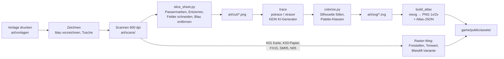

# 03 · Art- & Asset-Bibel

> **Für mzone: Das ist dein Arbeitsblatt.** Hier steht, **was** du zeichnest, **wie** du es zeichnest (Stift, Maß, Strichstärke) und **was danach damit passiert**.
> Die maschinenlesbare Liste mit Status-Spalte ist [`art/ASSET_REGISTER.csv`](../art/ASSET_REGISTER.csv). Die Tabellen in § 6 sind daraus generiert.
> **Druckvorlagen:** [`art/vorlagen/skizzenbogen_einheiten_A4.svg`](../art/vorlagen/skizzenbogen_einheiten_A4.svg) · [`art/vorlagen/skizzenbogen_gebaeude_A4.svg`](../art/vorlagen/skizzenbogen_gebaeude_A4.svg) (in 100 % / „Tatsächliche Größe“ drucken!)

---

## 1. Leitbild

> **„Eine Lagekarte auf dem Schreibtisch des Dirigenten. Tusche auf Papier. Figuren wie Spielsteine. Und die Welt wird erst gezeichnet, wenn jemand hinschaut.“**

| Stichwort | Bedeutung für jede Zeichnung |
|-----------|------------------------------|
| **Tusche** | Schwarze Linie, selbstbewusst, sichtbare Handschrift. Wackler sind erlaubt, Zögern nicht. |
| **Papier** | Warmer, heller Grund. Keine reinweißen Flächen. |
| **Lagekarte** | Karte von oben. Gebäude, Berge und Bäume im **Aufriss/Vogelschau** wie auf alten Landkarten. |
| **Spielsteine** | Figuren stehen **aufrecht auf Sockeln** (Kreis = ORCHESTRA, Sechseck = MONOLITH). Sockel macht der Code. |
| **Form vor Farbe** | Jede Einheit ist allein an ihrer **Silhouette** erkennbar. Farbe ist nur Zusatz. |
| **Zwei Formsprachen** | ORCHESTRA: **rund, offen, Funken ✦, Antennen**. MONOLITH: **kantig, geschlossen, Blöcke, Schraffur, Schlitz-Auge**. |
| **Partitur** | Die 4K-Sequenzen (D-16) **dirigieren** deine Zeichnungen: Sie bewegen, enthüllen, betuschen und belichten sie. **Der Code erfindet keine Linien.** (§ 11) |

**Stimmungs-Referenzen** (anschauen, nicht kopieren): historische Generalstabs- und Wanderkarten, Fantasy-Buchkarten, Feldskizzenbücher, Brettspiel-Spielsteine, Stempel und Karteikarten, Tintenklecks-Illustration.

---

## 2. Palette

Basis ist der **MZP-Stil `analog@1.1.0`**. Spiel, Diagramme, itch-Seite und Devlog teilen sich damit **eine** visuelle Sprache.

| Token | Hex | Herkunft | Verwendung im Spiel |
|-------|-----|----------|---------------------|
| `--sheet` | `#efe8d6` | MZP | **Kartenpapier**, Füllung der Figuren-Silhouetten |
| `--paper` | `#ded4bf` | MZP | Tisch/Hintergrund außerhalb der Karte, Fog „unerforscht“-Ränder |
| `--card` | `#f0e9db` | MZP | UI-Karteikarten, Tooltips, Squad-Karten |
| `--ink` | `#221d17` | MZP | **Tusche**: alle Linien |
| `--ink-soft` | `#6b6154` | MZP | **Bleistift-Zustand** (erforscht, nicht sichtbar), Sekundärtext |
| `--grid` | `#ded3bd` | MZP | Platzierungsraster |
| `--petrol` | `#3f7186` | MZP | **ORCHESTRA**: Sockel, eigene HP, Auswahl |
| `--petrol-deep` | `#2c5566` | MZP | ORCHESTRA dunkel: Sockelrand, Pipeline-Linien |
| `--rust` | `#a85c3c` | MZP | **MONOLITH**: Sockel, gegnerische HP, Angriffs-X |
| `--rust-deep` | `#8c3f21` | MZP | Warnungen, CONTEXT FLOOD, Niederlage-Stempel |
| `--gold` | `#b8892f` | **neu (Vorschlag)** | GOLD DATA, ORCHESTRATED-Stempel, Token-Symbol |

**Regeln:**
1. Auf dem Papier zeichnest du **nur schwarz**. Farbe kommt digital als **flache Fläche** aus dieser Palette.
2. **Keine weiteren Farben** ohne Eintrag hier. (Ausnahme: Halluzinations-Effekte dürfen mit `--gold` + `--petrol` flackern.)
3. Rot-Grün-Schwäche: Petrol und Rost unterscheiden sich in **Helligkeit und Form** (Kreis vs. Sechseck). Mit einem Farbfehlsichtigkeits-Simulator prüfen (Gate M3).

---

## 3. Typografie

| Rolle | Font | Lizenz | Warum |
|-------|------|--------|-------|
| UI, Zahlen, **Prompts** | **IBM Plex Mono** | SIL OFL 1.1 | Monospace = „Prompt-Zeile“. Gleiche Schrift wie MZP |
| Überschriften, Briefing, Stempeltexte | **Spectral** | SIL OFL 1.1 | Kartografisch-literarisch. Gleiche Schrift wie MZP |
| Notizen, Hinweise (Could) | **mzone-Handschrift** (F03) | eigene | Maximale Handgemachtheit, z. B. erstellt mit einem Handschrift-zu-Font-Dienst |
| Logo / Titel | **Handlettering** (UI16) | eigene | Keine Schrift, du schreibst es |

Fonts werden als `woff2` mit dem Spiel ausgeliefert, und die OFL-Lizenztexte landen im Repo unter `game/public/fonts/`.

---

## 4. Zeichenregeln für Papier

### 4.1 Material

| Material | Empfehlung | Wofür |
|----------|-----------|-------|
| Papier | Glattes Zeichenpapier oder Laserdruckpapier ≥ 100 g/m², A4 + 1–2 Bogen A3 | Vorlagen drucken, darauf zeichnen |
| **Vorzeichnen** | **Hellblauer Buntstift („Non-Photo-Blue“)** oder sehr heller Bleistift | wird beim Scan per Skript entfernt |
| **Außenkontur Einheiten** | **Brush-Pen oder Fineliner 1,0–2,0 mm** | Silhouette, die auch bei 48 px trägt |
| Innendetails Einheiten | Fineliner **0,5–0,8 mm** | Augen, Werkzeuge, Antennen |
| Gebäude Kontur / Details | **0,8–1,2 mm** / **0,3–0,5 mm** | Gebäude werden größer dargestellt |
| Karte A3 | **0,3–0,5 mm** Linien, **0,1–0,3 mm** Schraffur, Pinsel für Flächen | die Karte wird groß dargestellt |
| Flächen (Monolith, Kleckse) | Pinsel + Tusche, oder dicker Marker | Monolith ist **gefüllt schwarz** |
| Kleckse / Spritzer | Feder oder Pinsel, schnippen | FX01, FX02 |

### 4.2 Die Strichstärken-Physik (bitte einmal verstehen)

Das Spiel rendert mit **64 px pro Kachel** (Zoom 1,0). Was du auf Papier zeichnest, wird verkleinert. Als Ziel soll **jede Außenlinie im Spiel 2–4 px** und **jede Detaillinie ≥ 1 px** breit sein.

| Asset-Klasse | Papier-Maßstab | px pro mm (Zoom 1,0) | Außenkontur → px | Detail → px | Gefahr |
|--------------|---------------|:--------------------:|------------------|-------------|--------|
| **Agenten** (Figur ~30 mm hoch → 48 px) | Feld ø40 mm | **1,6** | 1,5 mm → **2,4 px** ✅ | 0,5 mm → 0,8 px ⚠️ · 0,8 mm → 1,3 px ✅ | **0,3-mm-Linien verschwinden (0,5 px)** |
| **Fahrzeuge** (TRANSFORMER, BATCH, BRUTEFORCE → 72 px) | Feld ø40 mm | **2,4** | 1,2 mm → 2,9 px ✅ | 0,5 mm → 1,2 px ✅ | – |
| **Gebäude** (1 Kachel = 20 mm) | Gebäude-Bogen | **3,2** | 1,0 mm → 3,2 px ✅ | 0,4 mm → 1,3 px ✅ | Schraffur < 0,3 mm wird Grau-Matsch |
| **Karte A3** (1 Kachel = 6,4 mm) | A3, 410 × 282 mm | **10** | 0,3 mm → 3 px ✅ | 0,15 mm → 1,5 px ✅ | Pinselflächen in der Karte sehr sparsam (Lesbarkeit der Einheiten darüber) |

> **Faustregel:** Je kleiner es im Spiel ist, desto **dicker und einfacher** zeichnest du. Agenten haben **keine Schraffur**.
> **Test vor dem Scannen:** Blatt auf 3 m Abstand halten. Erkennst du die Figur? Dann trägt sie auch bei 48 px.

### 4.3 Perspektive & Licht

| Regel | Detail |
|-------|--------|
| **Karte** | streng von oben |
| **Gebäude** | Vogelschau: Grundfläche von oben, Fassade **von schräg vorn (~30°)** sichtbar, Höhe ragt **nach oben** über die Grundfläche hinaus (dafür ist die Höhenzugabe im Gebäude-Bogen) |
| **Figuren** | aufrecht, **¾-Ansicht, Blick nach rechts**. Der Code spiegelt sie für Bewegung nach links → **keine Schrift und keine asymmetrischen Symbole auf Figuren** |
| **Licht** | **immer von oben links**. Schatten-Schraffur nur bei Gebäuden, auf der **rechten Fassadenseite**. Schatten unter Figuren macht der Code (Ellipse) |
| **Maßstab-Referenz** | Zeichne als Erstes den **EXECUTOR** (U02). Er ist das Maß aller Agenten: Alle anderen Figuren hältst du beim Zeichnen daneben |

### 4.4 Technische Pflichtregeln (sonst scheitert die Pipeline)

1. **Außenkontur geschlossen.** Die Pipeline füllt die Silhouette mit `--sheet`, damit die Karte nicht durch die Figur scheint. Eine Lücke in der Kontur macht die Figur durchsichtig.
2. **Nichts berührt den Feldrand.** Mindestens 3 mm Abstand zur Feldlinie.
3. **Ein Objekt pro Feld**, Ausnahme: Varianten-Sets wie SPAMMER, Spritzer und Risse (stehen im Register).
4. **ID ins Feld schreiben** (hellblau oder Bleistift im ID-Kästchen), z. B. `U02`, damit das Skript die Datei richtig benennt.
5. **Passermarken nicht übermalen**, die Ecken-Kreuze braucht das Skript zum Ausrichten.
6. **Nur schwarze Tusche** für finale Linien. Alles Hellblaue verschwindet.
7. **Line-Boil-Frames (… b):** Die Figur **frei nachzeichnen, nicht durchpausen**. Die kleinen Abweichungen *sind* die Animation.

---

## 5. Pipeline: Vom Papier ins Spiel



| Schritt | Wer | Werkzeug | Ergebnis | Hinweis |
|---------|-----|----------|----------|---------|
| 1 · Drucken | mzone | Drucker, **100 %** | Bögen mit Passermarken | Testdruck: 10-mm-Maßlinie auf dem Bogen nachmessen |
| 2 · Zeichnen | mzone | Stifte (§ 4.1) | fertiger Bogen | Register-Status → `gezeichnet` |
| 3 · Scannen | mzone | Flachbettscanner 600 dpi, **Farbe** (damit Blau erkennbar bleibt), keine Auto-Korrektur | `art/scans/<bogen>_<datum>.png` | **Alternative:** Scan-App am Handy, flach, Tageslicht, ohne Schatten. A3 im Copyshop scannen oder in **2 A4-Hälften** zeichnen (mit 1 Kachel Überlappung) |
| 4 · Schneiden | Claude Code | `tools/art/slice_sheet.py` (Python, OpenCV) | `art/cut/<ID>.png` | erkennt Passermarken, entzerrt, schneidet Felder nach Vorlagen-Geometrie, entfernt Blau, setzt einen Schwellwert |
| 5 · Vektorisieren | Claude Code | **potrace** (Konturen) oder **vtracer** | `art/svg/<ID>.svg` | deterministisch, kein generatives Modell. So bleibt die Grafik offenlegungsfrei |
| 6 · Einfärben | Claude Code | `tools/art/colorize.py` | SVG mit Silhouette `--sheet` + Tusche `--ink` | Teamfarbe kommt *nicht* in die Figur, sondern in den Sockel |
| 7 · Rendern & Packen | Claude Code | `resvg` + Atlas-Packer (Node) | `game/public/assets/atlas@1x.png`, `@2x.png`, `.json` | 2x für HiDPI und Zoom |
| 8 · Abnahme | mzone | Spiel im Browser | Register-Status → `im Spiel` | Checkliste § 9 |

**Raster-Weg** (keine Vektorisierung, Scan bleibt Textur): **K01 Karte**, **K03 Papier**, **FX15 Tusche-Ränder**, **SM05 Schraffur**, **N05 Krater**, **SQ02 Notenlinien**. Hier zählt die echte Papier- und Tuschestruktur. Die **Bleistift-Version** der Karte (Fog-Zustand „erforscht“) wird **automatisch** aus K01 erzeugt (entsättigen, aufhellen, `--ink-soft`). Du zeichnest sie **nicht** extra.

**Dateinamen:** `<ID>_<name>[_<frame>].svg`, z. B. `U02_executor_a.svg`, `U02_executor_b.svg`, `B03_tokenizer.svg`.

**Ordner:**

```
art/
├── ASSET_REGISTER.csv      ← Status-Tracking
├── vorlagen/               ← Druckvorlagen (SVG)
├── scans/                  ← Roh-Scans (Git LFS, falls > 50 MB gesamt)
├── cut/                    ← geschnittene Einzelbilder
└── svg/                    ← vektorisierte, eingefärbte Quellen
tools/art/                  ← Pipeline-Skripte (ab 01.11. im Spiel-Repo)
game/public/assets/         ← Build-Output fürs Spiel
```

---

## 6. Vollständige Asset-Liste

**Summe Zeichnungen** (aus dem Register):

| Priorität | Zeichnungen | Bedeutung |
|-----------|:-----------:|-----------|
| **M** (Tier 0) | **55** | ohne die geht es nicht |
| **S** (Tier 1) | **63** | macht das Spiel rund (davon 8 Monolith-Splitter für Sequenzen) |
| **C** (Tier 2) | **27** | wenn Zeit bleibt |
| **Gesamt** | **145** | |

**Bögen** (gerundet): Einheiten-Bogen à 12 Felder: **3 (M) / 6 (M+S) / 8 (alle)** · Gebäude-Bogen: **2 (M) / 3 (alle)** · Zeichnungen auf freien A4-Blättern: **12 (M) / 29 (M+S**, davon 8 Splitter auf einem gemeinsamen Blatt**)** · **1× A3** (Karte).

<!-- ASSET_TABLES_START -->
<!-- generiert aus art/ASSET_REGISTER.csv – bei Änderungen dort pflegen -->

### 6.1 Einheiten · ORCHESTRA

*14 Einträge · 14 Zeichnungen*

| ID | Name | Prio | Zeichen-Briefing | Bogen | Papier (mm) | Spiel 1x (px) | # | Quelle → Weg |
|----|------|:----:|------------------|-------|-------------|---------------|:-:|--------------|
| U01 | CRAWLER (Frame A) | **M** | Käfer-/Spinnenmaschine mit 6 Beinen, Sammelschaufel vorn, Datentank-Röhre auf dem Rücken (Füllstand leer lassen – kommt per Code) | Einheiten | Feld ø40 (Figur max 30 hoch) | 56 | 1 | Hand → Trace |
| U01b | CRAWLER (Frame B / Line Boil) | **S** | Dieselbe Figur frei nachgezeichnet (nicht durchgepaust) – kleine Abweichungen sind gewollt | Einheiten | Feld ø40 | 56 | 1 | Hand → Trace |
| U02 | EXECUTOR (Frame A) | **M** | Kleine aufrechte Figur, Kopf = Funken-Glyphe ✦, Werkzeugarm mit kurzem Blaster, Rucksack mit Antenne | Einheiten | Feld ø40 | 48 | 1 | Hand → Trace |
| U02b | EXECUTOR (Frame B) | **S** | Line-Boil-Variante | Einheiten | Feld ø40 | 48 | 1 | Hand → Trace |
| U03 | SCOUT (Frame A) | **M** | Schlanke Figur mit übergroßem Fernrohr-Auge, lange Antenne, Schrittstellung (Tempo) | Einheiten | Feld ø40 | 48 | 1 | Hand → Trace |
| U03b | SCOUT (Frame B) | **S** | Line-Boil-Variante | Einheiten | Feld ø40 | 48 | 1 | Hand → Trace |
| U04 | CRITIC (Frame A) | **M** | Figur mit runder Brille, großer Lupe in der Hand, Rotstift hinterm Ohr, Notizblock | Einheiten | Feld ø40 | 48 | 1 | Hand → Trace |
| U04b | CRITIC (Frame B) | **S** | Line-Boil-Variante | Einheiten | Feld ø40 | 48 | 1 | Hand → Trace |
| U05 | PLANNER (Frame A) | **S** | Figur mit Klemmbrett/Checkliste und Zirkel, Schirmmütze | Einheiten | Feld ø40 | 48 | 1 | Hand → Trace |
| U05b | PLANNER (Frame B) | **S** | Line-Boil-Variante | Einheiten | Feld ø40 | 48 | 1 | Hand → Trace |
| U06 | TRANSFORMER (Frame A) | **S** | Kettenfahrzeug, auf dem Rumpf 3–4 kleine Köpfe/Türmchen (Multi-Head), Spulen statt Kanonenrohr | Einheiten | Feld ø40 | 72 | 1 | Hand → Trace |
| U06b | TRANSFORMER (Frame B) | **S** | Line-Boil-Variante | Einheiten | Feld ø40 | 72 | 1 | Hand → Trace |
| U07 | INJECTOR | **C** | Figur mit riesiger Spritze, auf dem Kolben geschweifte Klammern { } | Einheiten | Feld ø40 | 48 | 1 | Hand → Trace |
| U08 | BATCH | **C** | Artilleriegeschütz, Munition als Stapel Lochkarten/Kisten, langes Rohr schräg nach oben | Einheiten | Feld ø40 | 72 | 1 | Hand → Trace |

### 6.2 Einheiten · MONOLITH

*6 Einträge · 8 Zeichnungen*

| ID | Name | Prio | Zeichen-Briefing | Bogen | Papier (mm) | Spiel 1x (px) | # | Quelle → Weg |
|----|------|:----:|------------------|-------|-------------|---------------|:-:|--------------|
| E01 | SHARD (Frame A) | **M** | Kantiger Splitter/Kristall auf zwei Stelzbeinen, waagerechter Schlitz als Auge, schwere Schraffur | Einheiten | Feld ø40 | 48 | 1 | Hand → Trace |
| E01b | SHARD (Frame B) | **S** | Line-Boil-Variante | Einheiten | Feld ø40 | 48 | 1 | Hand → Trace |
| E02 | SCRAPER (Frame A) | **M** | Kratzmaschine in Blockform mit Harke/Rechen vorn und prallem Beutesack hinten | Einheiten | Feld ø40 | 56 | 1 | Hand → Trace |
| E02b | SCRAPER (Frame B) | **S** | Line-Boil-Variante | Einheiten | Feld ø40 | 56 | 1 | Hand → Trace |
| E03 | BRUTEFORCE | **S** | Massiver Block auf Ketten mit Rammbock und zwei Hämmern | Einheiten | Feld ø40 | 72 | 1 | Hand → Trace |
| E04 | SPAMMER (3 Varianten) | **C** | Drei kleine Briefumschläge mit Fledermausflügeln, je leicht anders | Einheiten | Feld ø40 (3 im Feld) | 20 | 3 | Hand → Trace |

### 6.3 Gebäude · ORCHESTRA

*10 Einträge · 10 Zeichnungen*

| ID | Name | Prio | Zeichen-Briefing | Bogen | Papier (mm) | Spiel 1x (px) | # | Quelle → Weg |
|----|------|:----:|------------------|-------|-------------|---------------|:-:|--------------|
| B01 | CONDUCTOR CORE | **M** | Kuppelbau mit Dirigentenpult auf dem Dach, Taktstock als Antenne, Notenlinien als Fries – Vogelschau schräg von vorn | Gebäude 3x3 | 60x90 | 192x288 | 1 | Hand → Trace |
| B02 | COMPUTE PLANT | **S** | Serverschränke mit zwei Kühltürmen, Dampfwölkchen, Lüftungsgitter | Gebäude 2x2 | 40x60 | 128x192 | 1 | Hand → Trace |
| B03 | TOKENIZER | **M** | Großer Trichter, in den Datenwürfel fallen; unten Rutsche mit ✦-Münzen; seitliche Andockrampe für CRAWLER | Gebäude 3x3 | 60x90 | 192x288 | 1 | Hand → Trace |
| B04 | AGENT FORGE | **M** | Werkstatt mit Amboss vor dem Tor, Funkenflug, Schornstein | Gebäude 2x2 | 40x60 | 128x192 | 1 | Hand → Trace |
| B05 | MODEL FACTORY | **S** | Halle mit Sheddach, Rolltor, Förderband mit Bauteilen | Gebäude 3x3 | 60x90 | 192x288 | 1 | Hand → Trace |
| B06 | TELEMETRY TOWER | **S** | Gitterturm mit Radarschüssel, Seismographen-Kurve als Wimpel | Gebäude 2x2 | 40x60 | 128x192 | 1 | Hand → Trace |
| B07 | FIREWALL | **C** | Mauerstück aus Ziegeln mit stilisierten Flammenzinnen | Gebäude 1x1 | 20x30 | 64x96 | 1 | Hand → Trace |
| B08 | GUARDRAIL | **M** | Turm aus gestapelten Leitplanken-Segmenten, oben Prisma/Spule | Gebäude 1x1 | 20x30 | 64x96 | 1 | Hand → Trace |
| B09 | RESEARCH LAB | **C** | Labor mit Glaskuppel, darin Gehirn im Glas, Kolben und Rohre | Gebäude 2x2 | 40x60 | 128x192 | 1 | Hand → Trace |
| B10 | TUNING FORK | **C** | Riesige Stimmgabel auf Sockel, Notenlinien-Ringe drumherum | Gebäude 3x3 | 60x90 | 192x288 | 1 | Hand → Trace |

### 6.4 Gebäude · MONOLITH

*6 Einträge · 6 Zeichnungen*

| ID | Name | Prio | Zeichen-Briefing | Bogen | Papier (mm) | Spiel 1x (px) | # | Quelle → Weg |
|----|------|:----:|------------------|-------|-------------|---------------|:-:|--------------|
| M01a | THE MONOLITH Stage I | **M** | Schlanker schwarzer Block (Fläche mit Pinsel gefüllt), ein feiner Riss (Riss frei lassen – leuchtet per Code) | frei A4 | 100x150 | 320x480 | 1 | Hand → Trace |
| M01b | THE MONOLITH Stage II | **S** | Breiter, zweiter Block wächst seitlich an, mehrere Risse | frei A4 | 100x150 | 320x480 | 1 | Hand → Trace |
| M01c | THE MONOLITH Stage III | **S** | Riesig, Schlitz-Auge offen, Risse überall, schwebende Splitter | frei A4 | 100x150 | 320x480 | 1 | Hand → Trace |
| M01d | THE MONOLITH zerstört | **S** | Trümmerhaufen aus gebrochenen Blöcken | frei A4 | 100x150 | 320x480 | 1 | Hand → Trace |
| M02 | BROOD NODE | **M** | Kristallhaufen/Brutstätte, aus dem Splitter wachsen, Andeutung einer Schildkuppel | Gebäude 2x2 | 40x60 | 128x192 | 1 | Hand → Trace |
| M03 | OVERFITTER | **S** | Turm mit großem Zielscheiben-Auge (konzentrische Ringe) | Gebäude 1x1 | 20x30 | 64x96 | 1 | Hand → Trace |

### 6.5 Neutrale Objekte & Overlays

*13 Einträge · 16 Zeichnungen*

| ID | Name | Prio | Zeichen-Briefing | Bogen | Papier (mm) | Spiel 1x (px) | # | Quelle → Weg |
|----|------|:----:|------------------|-------|-------------|---------------|:-:|--------------|
| N01 | DATA FIELD voll | **M** | Haufen aus 15–20 kleinen Würfeln mit 0/1-Prägung | Gebäude 2x2 | 40x40 | 128x128 | 1 | Hand → Trace |
| N01b | DATA FIELD halb | **M** | Wie voll – 8–10 Würfel | Gebäude 2x2 | 40x40 | 128x128 | 1 | Hand → Trace |
| N01c | DATA FIELD fast leer | **M** | 3–4 Würfel und Krümel | Gebäude 2x2 | 40x40 | 128x128 | 1 | Hand → Trace |
| N02 | GOLD DATA voll | **S** | Wie DATA FIELD, größere Würfel mit Sternchen ✶ und Glanz-Strichen | Gebäude 2x2 | 40x40 | 128x128 | 1 | Hand → Trace |
| N02b | GOLD DATA halb | **S** | Wie oben, halb so viele | Gebäude 2x2 | 40x40 | 128x128 | 1 | Hand → Trace |
| N03 | LEGACY SERVER | **C** | Alter Mainframe-Schrank mit Bandspulen, Lochkarten, Spinnweben | Gebäude 2x2 | 40x60 | 128x192 | 1 | Hand → Trace |
| N04 | WRACK klein | **M** | Umgekippte, zerbrochene Figur – generisch für alle Fußeinheiten | Einheiten | Feld ø40 | 48 | 1 | Hand → Trace |
| N04b | WRACK groß | **M** | Zerbrochenes Fahrzeug-Wrack – generisch für CRAWLER/SCRAPER/Fahrzeuge | Einheiten | Feld ø40 | 64 | 1 | Hand → Trace |
| N05 | KRATER | **S** | Brandfleck/Krater mit Pinsel, ausgefranster Rand | Gebäude 1x1 | 20x20 | 64x64 | 1 | Hand → Raster |
| N06 | TRÜMMER 2x2 | **M** | Schuttfläche aus Brocken und Balken | Gebäude 2x2 | 40x40 | 128x128 | 1 | Hand → Trace |
| N06b | TRÜMMER 3x3 | **M** | Größere Schuttfläche | Gebäude 3x3 | 60x60 | 192x192 | 1 | Hand → Trace |
| D01 | RISSE (3 Varianten) | **S** | Drei Zickzack-Riss-Overlays für beschädigte Gebäude | Einheiten | Feld ø40 | 64 | 3 | Hand → Trace |
| D02 | RAUCH (2 Varianten) | **S** | Zwei Rauch-Kringel | Einheiten | Feld ø40 | 48 | 2 | Hand → Trace |

### 6.6 Karte

*3 Einträge · 7 Zeichnungen*

| ID | Name | Prio | Zeichen-Briefing | Bogen | Papier (mm) | Spiel 1x (px) | # | Quelle → Weg |
|----|------|:----:|------------------|-------|-------------|---------------|:-:|--------------|
| K01 | THE DESK Hauptkarte | **M** | Komplette Karte nach GDD § 12.2: Fluss, 2 Brücken, Klippen, Wälder, Sumpf, Straßen. KEINE Einheiten, Gebäude, Datenfelder (das sind Sprites). Bleistift-Vorzeichnung erlaubt, wird beim Scan entfernt | A3 quer | 410x282 (1 Kachel = 6.4) | 4096x2816 | 1 | Hand → Raster |
| K02 | Tischrand-Deko | **C** | Lineal, Zirkel, Kaffeefleck, Radiergummi, Bleistift – für Rand/Hauptmenü | frei A4 | frei | frei | 5 | Hand → Trace |
| K03 | Papiertextur | **M** | Ein leeres Blatt deines Zeichenpapiers scannen (Kachelung macht der Code) | frei A4 | A4 | 512x512 | 1 | Scan → Raster |

### 6.7 Effekte (FX)

*15 Einträge · 21 Zeichnungen*

| ID | Name | Prio | Zeichen-Briefing | Bogen | Papier (mm) | Spiel 1x (px) | # | Quelle → Weg |
|----|------|:----:|------------------|-------|-------------|---------------|:-:|--------------|
| FX01 | Treffer-Spritzer (3) | **M** | Drei kleine Tintenspritzer – Feder über dem Papier schnippen | Einheiten | Feld ø40 | 24 | 3 | Hand → Trace |
| FX02 | Tod-Klecks (2) | **M** | Zwei große Kleckse mit Spritzern | Einheiten | Feld ø40 | 64 | 2 | Hand → Trace |
| FX03 | Explosion (4 Frames) | **S** | Gebäude-Explosion: Blitz-Kritzel → Wolke → Kleckswolke → Rauchreste | Einheiten | Feld ø40 | 128 | 4 | Hand → Trace |
| FX04 | Halluzination ?! | **M** | Gedankenwolke mit ?! – bewusst wackelig | Einheiten | Feld ø40 | 32 | 1 | Hand → Trace |
| FX05 | Spiralen-Kritzel | **S** | Wirre Spirale (Kreativphase) | Einheiten | Feld ø40 | 32 | 1 | Hand → Trace |
| FX06 | Heil-Plus | **S** | Kleines freundliches Plus mit Strahlen | Einheiten | Feld ø40 | 16 | 1 | Hand → Trace |
| FX07 | Konvertier-Spirale | **C** | Spirale mit { } Klammern | Einheiten | Feld ø40 | 48 | 1 | Hand → Trace |
| FX08 | CONTEXT FLOOD Warnkreis | **S** | Großer Doppelkreis mit Schraffur und Tropfen (wird rost eingefärbt) | frei A4 | ø150 | 512 | 1 | Hand → Trace |
| FX09 | Monolith-Puls-Ring | **S** | Ausfransender Ring | Einheiten | Feld ø40 | 256 | 1 | Hand → Trace |
| FX10 | Bau-Staub | **S** | Flache Staubwolke | Einheiten | Feld ø40 | 96 | 1 | Hand → Trace |
| FX11 | Mündungs-Kritzel | **C** | Kleiner Stern-Kritzel | Einheiten | Feld ø40 | 16 | 1 | Hand → Trace |
| FX12 | BATCH-Projektil | **C** | Kleiner Stapel Lochkarten mit Bewegungslinien | Einheiten | Feld ø40 | 24 | 1 | Hand → Trace |
| FX13 | Stimmgabel-Wellen | **C** | Konzentrische Wellenringe | Einheiten | Feld ø40 | 256 | 1 | Hand → Trace |
| FX14 | Notenschlüssel (aligned) | **C** | Kleiner Notenschlüssel | Einheiten | Feld ø40 | 20 | 1 | Hand → Trace |
| FX15 | Tusche-Ränder (Fog-Maske) | **S** | Ein Blatt mit 6–8 ausfransenden Tuscherändern/Ausblutungen (Pinsel mit viel Wasser) | frei A4 | A4 | frei | 1 | Hand → Raster |

### 6.8 Marker

*6 Einträge · 7 Zeichnungen*

| ID | Name | Prio | Zeichen-Briefing | Bogen | Papier (mm) | Spiel 1x (px) | # | Quelle → Weg |
|----|------|:----:|------------------|-------|-------------|---------------|:-:|--------------|
| SM01 | Auswahlkreise (klein + groß) | **M** | Zwei Handkreise als flache Ellipsen, nicht ganz geschlossen | Einheiten | Feld ø40 | 48/72 | 2 | Hand → Trace |
| SM02 | Bewegungspfeil | **M** | Geschwungener Pfeil | Einheiten | Feld ø40 | 48 | 1 | Hand → Trace |
| SM03 | Angriffs-X | **M** | Kräftiges X | Einheiten | Feld ø40 | 32 | 1 | Hand → Trace |
| SM04 | Sammelpunkt-Fahne | **S** | Kleine Fahne am Stab | Einheiten | Feld ø40 | 32 | 1 | Hand → Trace |
| SM05 | Ungültig-Schraffur | **M** | Schraffurfeld 20x20 mm, an den Rändern kachelbar | Gebäude 1x1 | 20x20 | 64x64 | 1 | Hand → Raster |
| SM06 | Hinweispfeil groß | **M** | Großer, dynamischer Tusche-Pfeil fürs Onboarding | frei A4 | ca. 120 lang | 160 | 1 | Hand → Trace |

### 6.9 UI

*31 Einträge · 42 Zeichnungen*

| ID | Name | Prio | Zeichen-Briefing | Bogen | Papier (mm) | Spiel 1x (px) | # | Quelle → Weg |
|----|------|:----:|------------------|-------|-------------|---------------|:-:|--------------|
| UI01 | Sidebar-Rahmen | **M** | Hochkant-Rahmen wie ein Karteikasten; Ecken klar, Kanten gleichmäßig (9-Slice) | frei A4 | 70x230 | 220x720 | 1 | Hand → Trace |
| UI02 | Tab-Icons (4) | **S** | BUILD (Maurerkelle), DEFENSE (Schild), AGENTS (✦-Figur), MODELS (Zahnrad-Kopf) | Einheiten | Feld ø40 | 32 | 4 | Hand → Trace |
| UI03 | Cameo-Rahmen | **M** | Karteikarten-Rahmen für Bau-Icons (Inhalt = Ausschnitt der Einheiten-/Gebäudezeichnung) | Einheiten | Feld ø40 | 64x48 | 1 | Hand → Trace |
| UI04 | Ressourcen-Symbole (4) | **M** | TOKEN (Münze mit ✦), COMPUTE (Blitz im Zahnrad), CONTEXT ([ ]-Fenster), DATA (Würfel) | Einheiten | Feld ø40 | 24 | 4 | Hand → Trace |
| UI05 | Monolith-Balken | **M** | Langer Rahmen mit Strichskala, Markierungen bei 33 % und 66 %, kleiner Monolith-Kopf links | frei A4 | 180x20 | 560x40 | 1 | Hand → Trace |
| UI06 | Squad-Karte | **M** | Karteikarte quer mit Lochrand und Nummernfeld | frei A4 | 90x30 | 360x56 | 1 | Hand → Trace |
| UI06b | Chip-Form | **M** | Abgerundetes Etikett (Text kommt per Font) | Einheiten | Feld ø40 | 96x28 | 1 | Hand → Trace |
| UI06c | Verb-Icons (4) | **S** | Fernrohr (EXPLORE), Schild (HOLD), Fadenkreuz (HUNT), Fahne (ASSAULT) | Einheiten | Feld ø40 | 20 | 4 | Hand → Trace |
| UI07 | Stempel-Rahmen klein | **M** | Rechteckiger Stempelrahmen mit Doppellinie (Text per Font: FLOW, HALLUCINATING, ORCHESTRATED …) | Einheiten | Feld ø40 | 96x28 | 1 | Hand → Trace |
| UI08 | Button-Rahmen | **M** | Knopf als Papier-Etikett | Einheiten | Feld ø40 | 160x40 | 1 | Hand → Trace |
| UI08b | SELL-Icon | **M** | Münze mit Pfeil | Einheiten | Feld ø40 | 24 | 1 | Hand → Trace |
| UI08c | REPAIR-Icon | **C** | Schraubenschlüssel | Einheiten | Feld ø40 | 24 | 1 | Hand → Trace |
| UI09 | Cursor Standard | **M** | Federspitze | Einheiten | Feld ø40 | 32 | 1 | Hand → Trace |
| UI09b | Cursor Bewegen | **M** | Kreis mit Pfeil | Einheiten | Feld ø40 | 32 | 1 | Hand → Trace |
| UI09c | Cursor Angreifen | **M** | Fadenkreuz | Einheiten | Feld ø40 | 32 | 1 | Hand → Trace |
| UI09d | Cursor Nicht möglich | **M** | Durchgestrichener Kreis | Einheiten | Feld ø40 | 32 | 1 | Hand → Trace |
| UI09e | Cursor Verkaufen | **S** | Münze | Einheiten | Feld ø40 | 32 | 1 | Hand → Trace |
| UI09f | Cursor Reparieren | **C** | Schraubenschlüssel | Einheiten | Feld ø40 | 32 | 1 | Hand → Trace |
| UI09g | Cursor Injizieren | **C** | Spritze | Einheiten | Feld ø40 | 32 | 1 | Hand → Trace |
| UI10 | Minimap-Rahmen + NO SIGNAL | **S** | Rahmen und Kritzel-Rauschen für fehlende Telemetrie | frei A4 | 70x50 | 220x160 | 2 | Hand → Trace |
| UI11 | CONDUCTOR-Porträt neutral | **M** | Brustbild: Dirigent mit ✦-Funkenkopf, Frack, Taktstock | frei A4 | 60x60 | 96x96 | 1 | Hand → Trace |
| UI11b | CONDUCTOR-Porträt alarmiert | **S** | Taktstock erhoben, Funken sprühen | frei A4 | 60x60 | 96x96 | 1 | Hand → Trace |
| UI11c | CONDUCTOR-Porträt triumphierend | **S** | Verbeugung | frei A4 | 60x60 | 96x96 | 1 | Hand → Trace |
| UI12 | Notizzettel-Rahmen | **M** | Rahmen für Tooltip, Dialog, Pause, Optionen (9-Slice: Ecken klar, Kanten gleichmäßig) | frei A4 | 80x60 | frei | 1 | Hand → Trace |
| UI13 | Stempel DOMINATED | **M** | Handgeschriebener Stempel in Versalien, Doppelrahmen, leicht schief | frei A4 | 120x40 | 480x160 | 1 | Hand → Trace |
| UI13b | Stempel DISCONNECTED | **M** | wie oben | frei A4 | 120x40 | 480x160 | 1 | Hand → Trace |
| UI13c | Stempel SINGULARITY | **M** | wie oben | frei A4 | 120x40 | 480x160 | 1 | Hand → Trace |
| UI14 | Briefing-Blatt | **S** | MZP-analog-Figur: Lagekarte mit Pfeilen + 3 Sätze | MZP | – | 960x540 | 0 | MZP → MZP |
| UI15 | Hauptmenü-Komposition | **M** | Schreibtisch mit Karte, Stimmgabel, Taktstock – zusammengesetzt aus K01/K02/B10 + Logo | – | – | 1280x720 | 0 | Code → Code |
| UI16 | Logo / Titel-Schriftzug | **M** | Handlettering ORCHESTRATE & DOMINATE, darunter klein KAOD; Taktstock als Unterstreichung | frei A4 | 180x60 | 720x240 | 1 | Hand → Trace |
| UI17 | Lade-Kritzel (4 Frames) | **S** | Stift zeichnet einen Kreis in 4 Phasen | Einheiten | Feld ø40 | 64 | 4 | Hand → Trace |

### 6.10 Marketing (itch.io, GitHub, Devlog)

*10 Einträge · 1 Zeichnungen*

| ID | Name | Prio | Zeichen-Briefing | Bogen | Papier (mm) | Spiel 1x (px) | # | Quelle → Weg |
|----|------|:----:|------------------|-------|-------------|---------------|:-:|--------------|
| MK01 | itch Cover 630x500 | **M** | Komposition: Monolith oben rechts, Squad unten links, Logo – aus Spiel-Assets | – | – | 630x500 | 0 | Code → Komposition |
| MK02 | itch Banner | **S** | Breites Logo-Banner auf Papier | – | – | 960x200 | 0 | Code → Komposition |
| MK03 | Screenshots (5) | **M** | Aus dem Spiel: Basisbau, Squad-Prompt, Halluzination, Monolith Stage III, Sieg-Stempel | – | – | 1280x720 | 0 | Capture → Capture |
| MK04 | GIF (5–8 s) | **M** | Prompt geben → Squad zieht los → Karte zeichnet sich | – | – | 640x360 | 0 | Capture → Capture |
| MK05 | itch Seitenhintergrund | **S** | Papiertextur K03 als Kachel | – | – | 512x512 | 0 | Code → Komposition |
| MK06 | App-Icon 512 | **S** | ✦ im Kreis vor Monolith-Silhouette | Einheiten | Feld ø40 | 512 | 1 | Hand → Trace |
| MK07 | GitHub Social Preview | **C** | 1280x640 Komposition | – | – | 1280x640 | 0 | Code → Komposition |
| MK08 | How-to-play-Grafik | **S** | MZP-analog: Daten → Tokens → Squads → Prompt → Monolith | MZP | – | 960x540 | 0 | MZP → MZP |
| MK09 | Tech-Tree-Grafik | **C** | MZP-analog nach GDD § 9 | MZP | – | 960x540 | 0 | MZP → MZP |
| MK10 | Devlog-Header | **C** | Skizze vs. fertige Figur (MZP data-sketch) | MZP | – | 1200x400 | 0 | MZP → MZP |

### 6.11 Schriften

*3 Einträge · 1 Zeichnungen*

| ID | Name | Prio | Zeichen-Briefing | Bogen | Papier (mm) | Spiel 1x (px) | # | Quelle → Weg |
|----|------|:----:|------------------|-------|-------------|---------------|:-:|--------------|
| F01 | IBM Plex Mono | **M** | UI, Zahlen, Prompts (SIL OFL 1.1) | – | – | – | 0 | Font → – |
| F02 | Spectral | **M** | Überschriften, Briefing, Stempeltexte (SIL OFL 1.1) | – | – | – | 0 | Font → – |
| F03 | mzone-Handschrift | **C** | Eigene Handschrift als Font (z. B. via Calligraphr) für Notizen/Hinweise | Font-Vorlage | – | – | 1 | Hand → Font |

### 6.12 Sequenzen (D-16, nur für 4K-Sequenzen)

*3 Einträge · 12 Zeichnungen*

| ID | Name | Prio | Zeichen-Briefing | Bogen | Papier (mm) | Spiel 1x (px) | # | Quelle → Weg |
|----|------|:----:|------------------|-------|-------------|---------------|:-:|--------------|
| SQ01 | Monolith-Splitter (6–8 einzeln) | **S** | Einzelne kantige Bruchstücke des Monolithen in verschiedenen Größen, schwer schraffiert, für die Zerbrech-Animation (SQ-DOMINATED). Direkt nach M01a–d mit denselben Stiften zeichnen; auf einem freien A4-Blatt, Teile mit ≥ 5 mm Abstand | frei A4 | je 10–60 | 32–190 | 8 | Hand → Trace |
| SQ02 | Notenlinien-Blatt | **C** | Fünf freihändig gezogene Notenlinien über eine A4-Breite, Tusche, für Intro/Funkfenster (und als reißende Verbindungslinien in SQ-DISCONNECTED) | frei A4 | ca. 190 breit | 1280 breit | 1 | Hand → Raster |
| SQ03 | Uplink-Glyphe (3 Stufen) | **C** | Ein ✦-Funke, der aus einem Federklecks entsteht: Stufe 1 Klecks, Stufe 2 Klecks mit Strahlen, Stufe 3 klarer Funke – für den ersten Tastendruck (SQ-INTRO) | Einheiten | Feld ø40 | 64–96 | 3 | Hand → Trace |

<!-- ASSET_TABLES_END -->

---

## 7. Claude-Design-Einsatzplan

**Rolle:** Layout- und Typografie-Werkzeug. **Keine sichtbare Spielgrafik.** (Grill F5, Entscheidung D-11)
**Was es kann (Recherche-Stand):** Canvas-Prototyping, Iteration per Kommentar/Regler, Design-System-Import, Export als ZIP/PDF/PPTX/Standalone-HTML, nach Canva, **Übergabe an Claude Code**. **Kein dokumentierter SVG/PNG-Export.**

| # | Auftrag an Claude Design | Input | Output → Weiterverwendung | Wann |
|---|--------------------------|-------|---------------------------|------|
| CD1 | **HUD-Layout 1280×720**: Sidebar rechts 220 px, ORCHESTRATION BAR unten 120 px, Monolith-Balken oben, CONDUCTOR-Box, 3 Varianten | GDD § 15, Palette § 2, Fonts § 3 | HTML → Übergabe an Claude Code als Maß- und Abstandsvorlage | KW 43 |
| CD2 | **Squad-Karte + Chips**: Zustände (FLOW, HALLUCINATING, RETREATING, ORCHESTRATED), Prompt-Zeile | GDD § 7 | HTML → Maße für UI06/UI06b/UI07 | KW 43 |
| CD3 | **Hauptmenü, Pausemenü, Optionen, Endbildschirm mit Statistik** | GDD § 15 | HTML → Layout-Vorgabe | KW 44 |
| CD4 | **itch.io-Seitenlayout** (Reihenfolge: GIF → Pitch → Steuerung → Screenshots → Credits) | [Abgabe-Checkliste](11_ITCH_ABGABE_CHECKLISTE.md) | Texte + Reihenfolge → von Hand in itch.io eintragen | KW 48 |
| CD5 | **Pressekit-Einseiter** (PDF) | Pitch, Screenshots | PDF für Devlog/Social | KW 48 |

**Regeln:** (1) Palette und Fonts als Design-System vorgeben. (2) Keine generierten Bilder oder Illustrationen anfordern, nur Rahmen, Raster, Typo und Geometrie. (3) Was ins Spiel geht, wird **mit deinen gezeichneten Rahmen** (UI01, UI06, UI12 …) oder als schlichte Code-Geometrie umgesetzt.

---

## 8. MZP-Einsatzplan

**Rolle:** **Design-Token-Quelle** (Palette, Fonts, Strichcharakter) und **Diagramm-Werkzeug** im Stil `analog@1.1.0`. **Kein Sprite-Tracer** (Grill Red Flag 7).

| # | Figur | MZP-Bausteine (aus `analog`) | Export | Verwendung | Prio | Wann |
|---|-------|------------------------------|--------|------------|:----:|------|
| MZ1 | **How to Play** (MK08) | KI-Agent (18), Speicher (8), Pfeile (4), Sprechblase E/A (22) für „Prompt → Ausführung“, Warnstempel (15) für Monolith | PNG transparent + mit Hintergrund | itch-Seite, Hauptmenü „HOW TO PLAY“ | S | KW 47 |
| MZ2 | **Tech-Tree** (MK09) | Karte (2), Kante gewinkelt (24), Verzweigung (28) | `figure.svg` | itch-Seite, Devlog | C | KW 48 |
| MZ3 | **Missions-Briefing** (UI14) | Grenze/Rahmen (12), Pfeile (4), Randnotiz (14), Zeitachse (13) für das Pacing | `figure.svg` (im Spiel ladbar) | Briefing-Bildschirm | S | KW 47 |
| MZ4 | **Synergie-Pipeline** | KI-Agent (18) × 4, Ring/Zone (3), Kantenbeschriftung (26), Schleife (16) = Review-Loop | PNG | itch-Seite, Devlog | S | KW 47 |
| MZ5 | **„Von der Skizze zur Figur“** (MK10) | beliebig, mit `data-sketch` = Original-Scan (Button „Skizze zeigen“) | Seite/PNG | Devlog-Header, Making-of | C | Dezember |
| MZ6 | **Roadmap/Devlog-Zeitachse** | Zeitachse (13), Checkliste (5), Git-Bahn (6) | PNG | Devlog-Posts | C | laufend |

**MZP-Regeln, die wir übernehmen:** *Form vor Farbe* · *Legende ist Pflicht* auf jedem Blatt · ≤ 12 Knoten pro Blatt · Textpassung messen (`validateArtifact`: Ziel 0 FIGURE_FIT / 0 FIGURE_COLLISION) · Strichart `data-tusche="schwell"` für den Federstrich-Look.
**Bonus:** Der MZP-Baustein **„KI-Agent“ (Funken-Glyphe statt Kopf, Rand Petrol)** ist das **visuelle Vorbild für den ✦-Kopf** des EXECUTOR und des CONDUCTOR. Dadurch sind Diagramm-Welt und Spiel-Welt dieselbe.

---

## 9. Abnahme-Checkliste pro Asset

- [ ] **Silhouettentest:** Schwarz gefüllt noch erkennbar und von allen anderen Einheiten unterscheidbar?
- [ ] **1x-Test:** Bei Zoom 1,0 im Spiel lesbar? Keine Linie unter 1 px?
- [ ] **Maßstab:** Steht im richtigen Verhältnis neben dem EXECUTOR / der Kachel?
- [ ] **Formsprache:** ORCHESTRA rund/offen ✦ · MONOLITH kantig/geschlossen?
- [ ] **Spiegelung:** Sieht gespiegelt noch richtig aus (keine Schrift)?
- [ ] **Kontur geschlossen**, Silhouette korrekt gefüllt (Karte scheint nicht durch)?
- [ ] **Licht von oben links**, Schatten rechts (nur Gebäude)?
- [ ] **Register aktualisiert** (`Status`: offen → gezeichnet → gescannt → im Spiel)?

---

## 10. Zeichen-Reihenfolge (verbindlich)

| Batch | Inhalt | IDs | Zeichnungen | Ziel-Datum |
|-------|--------|-----|:-----------:|------------|
| **0 · Stil-Proben** | 1 Einheit, 1 Gebäude, 1 Kartenausschnitt (10 × 10 cm), **komplett durch die Pipeline** | U02, B03, K01-Probe | 3 | **So 11.10.** |
| 1 · Must-Einheiten | ORCHESTRA + MONOLITH + Wracks | U01–U04, E01, E02, N04, N04b | 8 | So 18.10. |
| 2 · Must-Gebäude & Felder | Gebäude, Monolith I, Brood Node, Datenfelder, Trümmer | B01, B03, B04, B08, M01a, M02, N01–N01c, N06, N06b | 11 | So 18.10. |
| 3 · Karte | THE DESK (A3) + Papierscan | K01, K03 | 2 | So 25.10. |
| 4 · Must-UI | Rahmen, Symbole, Cursor, Stempel, Logo, Porträt | UI01, UI03–UI09d, UI11, UI12, UI13–UI13c, UI16 | 22 | Sa 31.10. |
| 5 · Must-FX & Marker | Spritzer, Kleckse, ?!, Kreise, Pfeile, X, Schraffur | FX01, FX02, FX04, SM01–SM03, SM05, SM06 | 12 | Sa 31.10. |
| 6 · Should | Line-Boil-Frames, PLANNER, TRANSFORMER, BRUTEFORCE, Monolith II/III/zerstört **+ Splitter SQ01 (in derselben Sitzung wie M01b–d, gleiche Stifte)**, S-Gebäude, S-FX, S-UI | alle S | 63 | **Theme-abhängig**, 01.–20.11. |
| 7 · Could | nur nach Gate M3 (inkl. SQ02, SQ03) | alle C | 27 | 22.–27.11. |
| **Theme** | 2–6 Zeichnungen für das Theme-Modul | neu | 2–6 | 02.–08.11. |

> **Batch 0 ist ein Gate.** Wenn die Stil-Proben im Spiel nicht gut aussehen, ändern wir **zuerst die Regeln (Stifte, Maßstab)** und erst danach zeichnest du in Serie. Lieber am 11.10. eine Woche verlieren als am 15.11. alles neu zeichnen.

---

## 11. Sequenzen (D-16): Was die 4K-Partituren aus deinen Zeichnungen machen

> Jede Sequenz ist ein JavaScript-Programm von **höchstens 4096 Bytes**, eine **Partitur, die deine Zeichnungen dirigiert**. Der Code bewegt, enthüllt, betuscht und belichtet vorhandene Zeichnungen und setzt Timing, Tinte, Licht und den Synth fürs Leitmotiv. **Er erfindet keine Linien.** Zeichnungen, Stimme und Musik kommen aus dem Asset-Pool und zählen nicht zu den 4096 B. Katalog und Ablauf: [GDD § 19a](02_GAME_DESIGN_SPEC.md#19a-sequenzen-4k-partituren).

| Sequenz | Prio | Vorhandene Assets | Neue Assets |
|---------|:----:|-------------------|-------------|
| **SQ-INTRO** | S | K03 Papier, K01 Karte, FX15 Tusche-Ränder (Enthüllungsmaske), M01a Monolith, UI16 Logo, UI11 CONDUCTOR | SQ03 Uplink-Glyphe (C, Ersatz: ✦-Kopf des EXECUTOR aus U02), SQ02 Notenlinien (C) |
| **SQ-SINGULARITY** | S | K01, M01c, FX02 Kleckse, FX15, UI13c Stempel SINGULARITY | – |
| **SQ-DISCONNECTED** | S (Cut-Liste) | K01, UI11b, UI13b Stempel DISCONNECTED | **SQ02 als reißende Verbindungslinien.** Der Code darf keine Linien erfinden, die „Verbindungen“ müssen also gezeichnet sein. Wird SQ-DISCONNECTED gebaut, steigt **SQ02 auf S** |
| **SQ-DOMINATED** | S | K01, M01c → M01d, FX02, UI13 Stempel DOMINATED, UI11c | **SQ01 Monolith-Splitter** |
| **SQ-RADIO** | C | M01a–c, UI11/11b/11c, UI07 Stempelrahmen, FX09 Puls-Ring, FX08 Flood-Kreis | SQ02 (Notenlinien als Funk-Rahmen) |

**Zeichentipps für die Sequenz-Assets:**
- **SQ01 Splitter** gehören zum Monolithen: **gleiche Stifte, gleiche Pinselfüllung, gleicher Maßstab** wie M01a–d, also in derselben Sitzung zeichnen. Bruchkanten kantig und gerade, keine Rundungen (Formsprache MONOLITH). Varianten von klein (10 mm) bis groß (60 mm). Jede Bruchkante bekommt eine dünne Innenlinie, damit sie im Licht der Sequenz aufblitzen kann.
- **SQ02 Notenlinien** freihändig, **nicht mit Lineal**: Das Zittern ist das Bild. Fünf Linien, gleichmäßiger Abstand (~4 mm), eine Bewegung pro Linie.
- **SQ03 Uplink-Glyphe:** drei getrennte Felder. Stufe 1 ein runder Klecks, Stufe 2 derselbe Klecks mit 4–6 Strahlen, Stufe 3 ein klarer ✦ (wie der EXECUTOR-Kopf).

