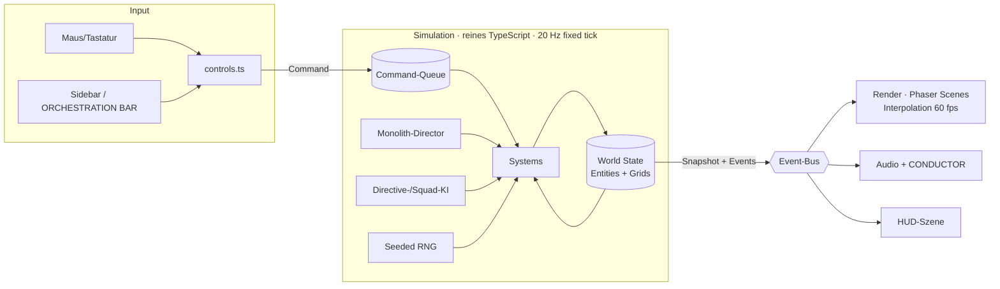

# 05 · Tech-Spec

> **Leitprinzipien:** (1) **Simulation getrennt von Darstellung.** (2) **Datengetrieben**: Balancing heißt Zahlen ändern, nicht Code. (3) **Testbar ohne Browser.** (4) **Browser-first**: Was nicht im itch.io-iframe läuft, existiert nicht.
> Spielcode entsteht **ab 01.11.2026** unter `game/` (Jam-Regel „start from scratch, templates allowed“). Das gilt auch für die 4K-Sequenzen (D-16) in `game/src/sequences/`. Nur die **Werkzeugkette `tools/4k/`** (Packer, Größen-Check, Vorschauseite) entsteht schon im Oktober, und zwar als Asset-Werkzeug der lokalen Claude-Code-Session.

---

## 1. Engine-Entscheidung (D-01)

**Vorschlag: Phaser 3 + TypeScript + Vite.** Die gewichtete Matrix steht in [Matrizen § 5](07_MATRIZEN.md#5-entscheidungsmatrix-engine).

| Grund | Erklärung |
|-------|-----------|
| **Browser-nativ** | kleiner Download (Engine ~1 MB gz), kein WASM-Threading/SharedArrayBuffer-Thema auf itch.io, sofortiger Start |
| **Alles ist Text** | Code, Daten, Szenen sind TypeScript. Claude Code kann alles lesen, ändern und testen, ohne Editor-GUI |
| **SVG-Pipeline** | lädt SVG direkt (rasterisiert beim Laden in Wunschgröße) oder vorgerenderte Atlanten |
| **Testbarkeit** | Simulation in reinem TS → **Vitest** headless, E2E mit **Playwright** (Chromium ist in der Cloud-Umgebung vorinstalliert) |
| **Doku & Beispiele** | sehr große Community, viele RTS-nahe Beispiele (Tilemaps, Kamera, Input) |

**Wann stattdessen Godot 4 (GDScript)?** Wenn du (Grill B4) Godot bereits sicher beherrschst. Godot hat eingebaute Navigation (AStarGrid2D), einen Szeneneditor und ein besseres Animationstooling. Der Web-Export ist größer, aber seit Godot 4.3 auch ohne Threads möglich. **Kein C#**, denn der Web-Export von Godot-C# ist nicht praxistauglich.
**Versionsstand:** Am 01.11. die **aktuelle stabile Phaser-Version** prüfen und festnageln (`package-lock.json`). Mitten im Jam wird **kein** Major-Upgrade gemacht.

---

## 2. Architektur



- **Commands** (Spieler und KI identisch): `Move`, `AttackMove`, `Attack`, `Stop`, `Build`, `Place`, `Produce`, `Sell`, `FormSquad`, `SetDirective`, `UseSuperweapon`, …
- **Events** (Sim → Rest): `UnitSpawned`, `UnitDied`, `BuildComplete`, `Hallucination`, `StageChanged`, `FloodWarning`, `Victory`, … Audio und HUD hängen **nur** an Events.
- **Fixed Tick 20 Hz** (50 ms), Render interpoliert Positionen. Die Spielgeschwindigkeit (0,75/1/1,25×) skaliert die Ticks pro Sekunde.
- **Deterministisch** mit Seed-RNG. Damit sind Szenario-Tests und (Could) Replays reproduzierbar.

---

## 3. Verzeichnisstruktur (ab 01.11.)

```
game/
├── index.html
├── package.json · tsconfig.json (strict) · vite.config.ts (base: './')
├── src/
│   ├── main.ts
│   ├── data/                  ← ALLE Balancing-Zahlen
│   │   ├── units.ts           ← GDD § 8, § 10.3
│   │   ├── buildings.ts       ← GDD § 9, § 10.4
│   │   ├── combat.ts          ← Schadensmatrix GDD § 11
│   │   ├── economy.ts         ← GDD § 6
│   │   ├── monolith.ts        ← Wachstum, Stufen GDD § 10.2
│   │   ├── waves.ts           ← Director GDD § 10.6
│   │   ├── directives.ts      ← Verben/Ziele/Bedingungen, Halluzination, Synergien GDD § 7
│   │   ├── difficulty.ts      ← GDD § 14
│   │   └── strings.en.ts      ← ALLE Texte (Lokalisierung vorbereitet)
│   ├── sim/
│   │   ├── world.ts · entities.ts · grid.ts · rng.ts · commands.ts · events.ts
│   │   └── systems/
│   │       ├── movement.ts · pathfinding.ts · separation.ts
│   │       ├── combat.ts · targeting.ts · spatialHash.ts
│   │       ├── economy.ts · compute.ts · production.ts · construction.ts
│   │       ├── vision.ts
│   │       ├── squads.ts · directives.ts · hallucination.ts · synergies.ts
│   │       ├── monolithDirector.ts · monolithGrowth.ts
│   │       └── victory.ts
│   ├── render/
│   │   ├── scenes/  Boot · Preload · Title · Briefing · Game · Hud · End
│   │   └── view/    unitView · buildingView · fogLayer · selection · fx · lineBoil
│   ├── ui/          sidebar · orchestrationBar · monolithBar · conductorBox · tooltip · menus
│   ├── audio/       audioManager · conductorQueue
│   ├── input/       controls · camera · placement
│   ├── theme/       themeModule.ts   ← THEME-SLOT (GDD § 20)
│   ├── sequences/   ← 4K-SEQUENZEN (D-16, GDD § 19a), lokale Session
│   │   ├── host.ts  ← typisierter Host-Vertrag: playSequence(id, params) → Promise
│   │   └── sq-intro.js · sq-dominated.js · sq-singularity.js · sq-disconnected.js · sq-radio.js
│   │                ← je ≤ 4096 B gepackt (Build-Check)
│   └── debug/       overlay · cheats (nur Dev-Build)
├── public/
│   ├── assets/      atlas@1x.png · atlas@2x.png · atlas.json · map/ · fx/
│   ├── audio/       sfx.ogg/mp3 + sfx.json · music/
│   └── fonts/       *.woff2 + OFL.txt
└── tests/
    ├── unit/        *.test.ts (Vitest)
    ├── scenarios/   headless Komplett-Partien
    └── e2e/         smoke.spec.ts (Playwright)
tools/
├── art/   slice_sheet.py · trace.sh · colorize.py · build_atlas.ts · make_pencil_map.py
├── audio/ process_voice.sh (ffmpeg/sox-Kette) · build_sfx_sprite.ts
└── 4k/    Packer · Größen-Check (Abbruch bei 4097 B) · Vorschauseite   ← Oktober, lokale Session (D-16)
.github/workflows/  ci.yml · deploy.yml
```

---

## 4. Simulation im Detail

### 4.1 Welt & Raster

| Raster | Auflösung | Inhalt |
|--------|-----------|--------|
| `terrain` | 64 × 44 | PAPER, LAKE, CLIFF, ROAD, SWAMP, FOREST, FORD (aus Tiled-JSON) |
| `occupancy` | 64 × 44 | Gebäude-Belegung (blockiert Wegfindung) |
| `visibility` | 64 × 44 | 0 = unerforscht, 1 = erforscht, 2 = sichtbar (Spieler) |
| `spatialHash` | 16 × 11 Zellen à 4 Kacheln | schnelle Nachbarsuche für Zielwahl und Separation |

Entities sind schlichte Objekte in einer `Map<id, Entity>` mit optionalen Komponenten (`pos`, `health`, `weapon`, `harvester`, `producer`, `squad`, `vision` …). Bei ≤ 300 Entities ist ein ECS-Framework überflüssig.

### 4.2 Wegfindung (größtes technisches Risiko, Woche 1)

| Baustein | Umsetzung | Prio |
|----------|-----------|:----:|
| A* auf dem Raster | 8 Nachbarn, Oktil-Heuristik, Kosten pro Gelände (SWAMP ×1,67, ROAD ×0,77) | M |
| Pfadglättung | Sichtlinien-Abkürzung (String-Pulling) | M |
| Anfrage-Budget | Warteschlange, max. **2 ms pro Tick** für Pfadsuche, Rest im nächsten Tick | M |
| Gruppenbewegung | gemeinsamer Pfad + Formations-Offsets am Ziel (Spirale um den Zielpunkt) | M |
| Lokale Ausweichbewegung | Separation-Steering + „Schubsen“ stehender eigener Einheiten | M |
| Feststecken | kein Fortschritt für 2 s → neu planen. Nach 3 Versuchen: nächstgelegenen erreichbaren Punkt nehmen | M |
| Flow-Field | für Gruppen > 8 Einheiten mit gleichem Ziel (Wellen, ASSAULT) | S |

### 4.3 Kampf

Zielwahl alle 250 ms über den Spatial Hash (nächster Gegner in Reichweite; mit PLANNER: niedrigste HP). Treffer sofort (Hitscan), Schaden = `basis × matrix[waffe][rüstung] × boni`. Boni werden multiplikativ verrechnet: FLOW, Markierung, ATTENTION, ORCHESTRATED, Schwierigkeit.

### 4.4 Ökonomie, Produktion, Bau

- CRAWLER-Zustandsautomat: `ToField → Harvest → ToRefinery → Unload → …` mit Auswahl des nächsten nicht erschöpften Feldes.
- Produktion: Warteschlange pro Gebäude (max. 5). Fortschritt pro Tick × Compute-Faktor (LOW COMPUTE = 0,5).
- Bau: ein Gebäude gleichzeitig. Platzierung gültig, wenn alle Kacheln frei, passierbar, **erforscht** und innerhalb von Bauradius 6 eines eigenen Gebäudes sind.

### 4.5 Sicht & Fog

- `visibility` wird mit **5 Hz** aktualisiert: Sichtkreise aus vorberechneten Offsets je Sichtweite.
- **M:** keine Sichtlinien-Blockade. **S:** CLIFF und FOREST blockieren (Bresenham-Strahlen, gecacht).
- **Darstellung:** Die Karte liegt **zweimal** vor: Tusche-Version (K01) und Bleistift-Version (automatisch erzeugt). Eine **Masken-Textur mit 1 Pixel pro Kachel** (64 × 44) wird linear hochskaliert und weichgezeichnet. Unerforscht → Papiertextur, erforscht → Bleistift, sichtbar → Tusche. **S:** Der Maskenrand wird mit der Tusche-Ränder-Textur (FX15) per Schwellwert-Shader „ausgefranst“, und neu aufgedeckte Kacheln blenden über 400 ms ein (Tinte breitet sich aus).

### 4.6 Squads, Direktiven, Halluzination, Synergien

```
Squad.update() alle 500 ms:
  if directCommandActive(squad)                 → nichts (Direktive pausiert)
  if idleSince(squad) < 3 s                     → nichts
  if rng() < hallucinationChance(squad) (alle 5 s) → startHallucination(3 s)
  switch directive.verb:
    EXPLORE: ziel = nächste Fog-Grenze (Frontier-Suche auf visibility, gecacht)
             if feindStärke(nahe) > squadStärke → anderes Frontier-Ziel
    HOLD:    if feind im Radius 6 → angreifen, max. 8 Kacheln verfolgen, dann zurück
    HUNT:    ziel = nächster bekannter Feind vom Zieltyp → AttackMove
    ASSAULT: AttackMove zum Punkt, dann HOLD dort
  conditions (nur mit PLANNER): RETREAT@30 → zum CORE · ONLY IF STRONGER · AVOID TOWERS (Kostenaufschlag im A*)
  flow = (keine direkten Befehle seit 5 s)
  synergies = berechne aus Zusammensetzung (gecacht bis Squad sich ändert)
```

`squadStärke` = Σ (DPS × HP) der Mitglieder. Grob, aber ausreichend und nachvollziehbar.

### 4.7 Monolith-Director

Reines Datenmodell aus `waves.ts` und `monolith.ts` (siehe [GDD § 10.6](02_GAME_DESIGN_SPEC.md#106-director-ki-m)). Timer, Budget, Zielwahl mit gewichtetem Zufall, Reaktionen über Events (`UnderAttack`). **Keine Sonderlogik im Render-Code.**

### 4.8 Theme-Slot

`theme/themeModule.ts` exportiert Hooks, die die Sim an festen Stellen aufruft: `onTick`, `onWave`, `modifyUnitStats`, `extraVictoryCondition`, `extraTerrain`, `extraDirective`. Bis 01.11. bleibt es ein leeres Modul, danach wird **nur hier** das Theme implementiert. Das hält den Rest stabil.

---

## 5. Darstellung

| Thema | Umsetzung |
|-------|-----------|
| Auflösung | logisch **1280 × 720**, Scale-Mode „FIT“ mit Letterbox in `--paper`, Fullscreen-Button |
| Atlanten | `atlas@1x` / `@2x` je nach `devicePixelRatio`, eine Textur-Seite ≤ 4096² |
| Karte | K01 als Bild in Kacheln von 1024², damit die GPU-Grenzen auf schwachen Geräten halten |
| Sockel | per Code: Kreis (Petrol) / Sechseck (Rost), HP-Ring als Bogen um den Sockel |
| Spiegeln | `flipX` bei Bewegung nach links |
| Line Boil | **S:** 2 Frames, 6–8 fps, pro Einheit zufällig phasenversetzt. **Fallback:** Displacement-Effekt mit Rauschtextur |
| Gebäude-Einzeichnen | Masken-Wipe (diagonal) über 1 s |
| Tiefensortierung | nach Fußpunkt-Y (Vogelschau braucht das, weil Gebäude nach oben über ihre Grundfläche ragen) |
| UI | eigene Phaser-Szene über der Spielszene. Texte in IBM Plex Mono/Spectral via `@font-face`, Start erst nach `document.fonts.ready` |
| Freitext-Prompt (C) | DOM-`<input>` als Overlay (Barrierefreiheit, IME) |

---

## 5a. Sequenzen (D-16)

> Spezifiziert werden hier nur **Vertrag und Grenzen**. Packer, Entpack-Technik, Tusche-Shader und Synth gestaltet die lokale Claude-Code-Session in `tools/4k/` und `game/src/sequences/`.

| Thema | Festlegung |
|-------|-----------|
| **Programmformat** | Jede Sequenz ist ein eigenständiges JavaScript-Programm, **selbst entpackend**, als ausgelieferte Datei **≤ 4096 Bytes** |
| **Größenregel** | `npm run build` packt die Sequenzen mit `tools/4k/` und prüft jede Datei. **Ab 4097 B bricht der Build ab.** Die CI führt dieselbe Prüfung aus und gibt die Bytes pro Sequenz im Größenbericht aus |
| **Was zählt** | nur das gepackte Programm. Zeichnungen, Stimmaufnahmen und Musik kommen aus dem Asset-Pool und zählen nicht |
| **Host-Vertrag** | `playSequence(id, params) → Promise<void>` (typisiert in `sequences/host.ts`). Der Host liefert **nur Daten**: Canvas (Vollbild-Ebene oder Bild-im-Bild-Bereich), `AudioContext`, geladene Zeichnungen (nach Asset-ID), dekodierte Audio-Buffer, Parameter (z. B. Statistik, Monolith-Stufe, Seed) sowie ein `AbortSignal` fürs Überspringen. **Keine Logik im Host** |
| **Ladeformat** | Der Host lädt die Datei als Bytes, macht daraus einen String mit **einem Zeichen pro Byte** (Zeichencode = Byte, weder UTF-8 noch windows-1252) und ruft `Function('$', text)($)` auf. Die Sequenz liefert ein Promise zurück. Der Stub entpackt per `DecompressionStream('deflate-raw')` (Stand `tools/4k/`: 166 B) |
| **Felder von `$`** | `c` Canvas (Gerätepixel, Größe jeden Frame neu lesen) · `a` `AudioContext` (läuft schon) · `o` Audio-Ausgang (`GainNode`, Host kann ducken) · `d` Zeichnungen `{Asset-ID: ImageBitmap}` · `v` Stimmen `{V…: AudioBuffer}` · `m` Musik `{MU…: AudioBuffer}` · `p` Parameter · `q` `AbortSignal`. Quelle der Wahrheit: [`tools/4k/README.md`](../tools/4k/README.md), ab November `game/src/sequences/API.md` |
| **Browser-Mindeststand** | WebGL2, WebAudio und `DecompressionStream('deflate-raw')`: Chrome 80+, Firefox 113+, Safari 16.4+. Fehlt etwas, gilt der Rückfall (GDD § 14) |
| **Wann sie laufen** | **vor dem Spiel** (SQ-INTRO), **am Ende** (SQ-DOMINATED/-SINGULARITY/-DISCONNECTED), **Bild im Bild** (SQ-RADIO) bei laufender Simulation. Keine Vollbild-Unterbrechung im Spiel |
| **Überspringen** | Der Host bricht über das `AbortSignal` ab, die Sequenz stoppt ihre Audioquellen, und das Promise wird erfüllt |
| **Rückfall** | Fehlt die Sequenz, wirft sie einen Fehler oder ist sie nach **Maximallänge + 2 s** nicht fertig, beendet der Host sie und zeigt die Darstellung aus GDD § 14 |
| **Budget SQ-RADIO** | ≤ 2 ms pro Frame, damit das Spiel weiter flüssig läuft |
| **Konventionen** | Sequenzen sind bewusst handoptimiertes Size-Coding-JavaScript, deshalb gelten Lint- und Strict-Regeln dort nicht. Der Host-Vertrag in `host.ts` bleibt `strict` |

**Zu prüfen beim Release-Probelauf (15.11.):** Selbst entpackende Programme brauchen Code-Auswertung zur Laufzeit (`tools/4k/` nutzt `Function('$', code)`, also CSP `unsafe-eval`). Ob das im itch.io-iframe funktioniert, wird mit einer Test-Sequenz auf der privaten itch-Seite geprüft. **Rückfall:** dieselbe Sequenz ungepackt ausliefern. Die 4096-B-Regel bleibt dann als Build-Disziplin erhalten.

---

## 6. Performance-Budgets

| Messgröße | Budget | Messung |
|-----------|--------|---------|
| FPS | **≥ 55** auf Mittelklasse-Laptop (integrierte GPU), ≥ 30 im Worst Case | Debug-Overlay |
| Sim-Tick | ≤ 4 ms (bei 250 Entities) | `performance.now()` pro Tick |
| Pfadsuche | ≤ 2 ms pro Tick (Budget) | Zähler im Overlay |
| Entities gleichzeitig | 250 (Spieler 60 + Monolith 120 + Effekte) | Stresstest-Szenario |
| Download gesamt | **≤ 15 MB** Ziel, ≤ 30 MB hart | `dist/` Größe in CI ausgeben |
| Ladezeit bis Titelbild | ≤ 5 s auf 20 Mbit/s | manuell |
| Speicher | ≤ 400 MB JS-Heap | DevTools |
| **Sequenz-Programm** | **≤ 4096 B je Datei (hart)** | Build-Check `tools/4k/` + CI |
| SQ-RADIO | ≤ 2 ms pro Frame | Debug-Overlay |

---

## 7. Build, Deploy, CI

| Schritt | Werkzeug | Details |
|---------|----------|---------|
| Lokal | `npm run dev` | Vite Dev-Server, Hot Reload |
| Prüfen | `npm run check` | `tsc --noEmit` + ESLint + Prettier + Vitest |
| Bauen | `npm run build` | `vite build` mit **`base: './'`** (relative Pfade – Pflicht für itch.io!) → `dist/`. Davor: Sequenzen packen und **4K-Größencheck** (Abbruch bei 4097 B) |
| CI | GitHub Actions `ci.yml` | bei jedem Push: check + build (inkl. 4K-Check) + Playwright-Smoke + Größenbericht (gesamt und Bytes pro Sequenz) |
| Vorschau | GitHub Pages (`deploy.yml`, Branch `main`) | Spielbare Vorschau für Tester ohne itch.io |
| itch.io | **butler** (`butler push dist maierzone/orchestrate-and-dominate:html5`) | bei Tag `v*`. Secret `BUTLER_API_KEY` in den Repo-Secrets (**mzone legt an**) |
| Jam-Einreichung | **manuell** auf der Jam-Seite | siehe [Abgabe-Checkliste](11_ITCH_ABGABE_CHECKLISTE.md) |

**itch.io-Eigenheiten:** `index.html` im Wurzelverzeichnis des ZIP · nur relative Pfade · iframe-Größe 1280 × 720 + Fullscreen-Button · „SharedArrayBuffer“-Option **aus** (brauchen wir nicht) · Groß-/Kleinschreibung der Dateinamen exakt (Linux-Server) · Dateianzahl klein halten (Atlanten + Audio-Sprites → < 50 Dateien).

---

## 8. Teststrategie

| Ebene | Was | Werkzeug | Wann |
|-------|-----|----------|------|
| **Unit** | Schadensmatrix, Ökonomie-Zyklus, A* auf Testkarten, Bauplatz-Validierung, Synergie-Berechnung, Halluzinationsrate (Seed, 10.000 Würfe ±1 %), Siegbedingungen | Vitest | bei jedem Commit |
| **Szenario (headless)** | Komplette Partie mit Skript-Bot (baut, sammelt, schickt Squads mit HUNT SCRAPER), 20 min Sim-Zeit in < 10 s: keine Exceptions, Monolith-Kurve im erwarteten Korridor, Sieg auf STORY möglich | Vitest | täglich + vor jedem Gate |
| **Balancing-Regression** | Gleiche Seeds, Kennzahlen (Siegzeit, Monolith-% bei Minute 5/10) gegen Vorwerte, Warnung bei > 15 % Abweichung | Vitest-Snapshot | ab Woche 3 |
| **E2E-Smoke** | Build laden, „CLICK TO CONDUCT“, Spiel starten, 10 s laufen lassen: keine Konsolenfehler, Canvas nicht leer | Playwright (Chromium) | CI |
| **Sequenzen** | Größencheck ≤ 4096 B · jede Sequenz mit Test-Parametern abspielen: Promise wird innerhalb Maximallänge + 2 s erfüllt, keine Konsolenfehler · Überspringen per `AbortSignal` · Rückfall bei absichtlich fehlerhafter Sequenz | `tools/4k/` + Playwright | CI |
| **Mensch** | Playtest-Protokoll (siehe [Zeitplan](06_ZEITPLAN.md#6-playtest-protokoll)) | – | 15.11., 22.11., 27.11. |

**Debug-Werkzeuge (nur Dev-Build):** `F1` Overlay (FPS, Entities, Pfad-Queue, Tick-Zeit) · `F2` Pfade/Ziele zeichnen · `F3` Karte aufdecken · `F4` +1000 Tokens · `F5` Monolith +10 % · `F6` Zeitraffer ×4.

---

## 9. Konventionen

TypeScript `strict`, kein `any` · ESLint + Prettier · kleine Module (< 300 Zeilen) · **Alle Zahlen in `data/`**, keine magischen Zahlen in Systemen · **alle Texte in `strings.en.ts`** · Conventional Commits (`feat:`, `fix:`, `art:`, `audio:`, `docs:`) · täglicher Commit mit Devlog-Zeile.

---

## 10. Technische Risiken (Detail zu [Matrizen § 3](07_MATRIZEN.md#3-risikomatrix))

| Risiko | Gegenmaßnahme |
|--------|---------------|
| Wegfindung ruckelt oder bleibt stecken | Woche 1 zuerst, Budget-Queue, Stresstest-Szenario ab Tag 5 |
| Fog-Rendering zu teuer | Masken-Textur mit 1 px/Kachel statt Vollauflösung, Update mit 5 Hz |
| Große Kartentextur sprengt GPU-Limits | Kartenkacheln à 1024² |
| Audio startet nicht (Autoplay-Sperre) | Klick-Startbildschirm, Audio-Kontext erst danach |
| Safari-Eigenheiten | MP3-Fallback, WebGL-Kontextverlust abfangen, Test auf Safari am 22.11. (falls Gerät vorhanden) |
| Build läuft lokal, auf itch nicht | **Release-Probelauf am 15.11.** auf einer privaten itch-Seite |
| Selbst entpackende Sequenz wird im itch-iframe blockiert | Test-Sequenz im Probelauf am 15.11. Rückfall: ungepackt ausliefern (Größenregel bleibt Build-Disziplin) |
| Sequenz hängt oder wirft Fehler | Host-Timeout (Maximallänge + 2 s) → Rückfall-Darstellung GDD § 14 |
| Sequenzen fressen Zeit | erst nach Gate M2, feste Reihenfolge, Cut-Liste ([Zeitplan § 7](06_ZEITPLAN.md#7-cut-liste-reihenfolge-ist-verbindlich)) |

---

## 11. Ausblick (Won’t im Jam): Echte LLM-Direktiven

Die Direktiven-Eingabe läuft über ein Interface `DirectiveInterpreter`:

- **Jam:** `KeywordInterpreter`, ein lokaler Parser (Could), deterministisch und kostenlos.
- **Post-Jam (optional):** `LlmInterpreter` mit **eigenem API-Key des Spielers** (BYOK, bleibt im Browser des Spielers). Übersetzt Freitext in **dieselbe** strukturierte Direktive (VERB/ZIEL/BEDINGUNG), z. B. über ein schnelles, günstiges Modell der jeweils aktuellen Claude-Generation mit strukturierter Ausgabe. Die Spielregeln bleiben dabei **deterministisch**, und das LLM übersetzt nur die Eingabe.

So bleibt die Tür offen, ohne den Jam zu gefährden.
